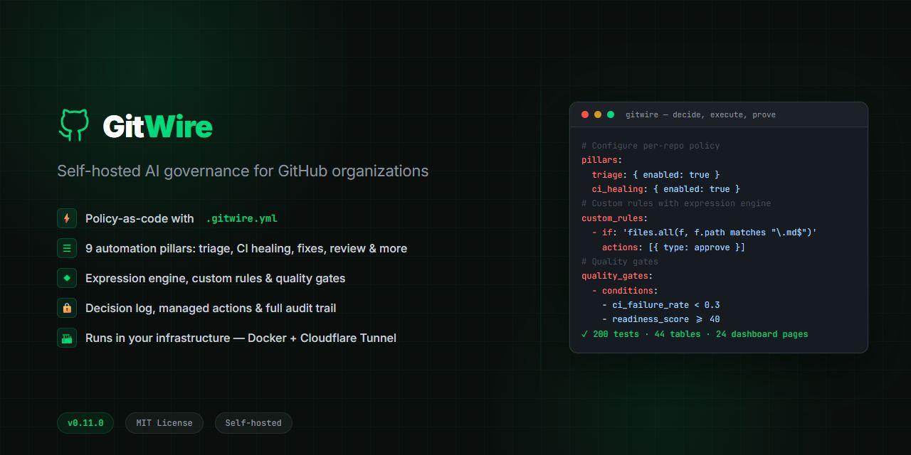
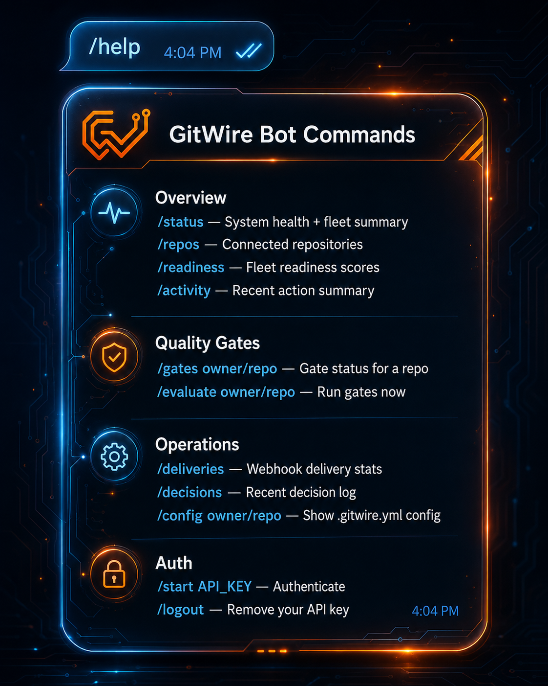

<p align="center">
  
</p>

<div align="center">

# GitWire

**Self-hosted AI governance for GitHub individuals and teams.**

GitWire watches your repositories, evaluates policy, runs safe automations, and records proof for every action.

**Decide. Execute. Prove.**


</div>

---

## What GitWire Is

GitWire is an AI maintainer control plane for GitHub individuals and teams. It brings repository automation, policy evaluation, quality gates, action tracking, and audit evidence into one self-hosted system.

It is built for maintainers who want automation with clear boundaries: every action should have a reason, a policy basis, an execution record, and a way to verify what happened afterward.

Use GitWire when you want to answer:

- Which repositories need attention?
- Which AI or automation action is allowed to run?
- Why was a label, comment, review, branch, PR, or merge action created?
- Did the action still hold after the repository changed?
- Which decisions were skipped, blocked, retried, or reconciled?

### Core Model

```
GitHub events
    → policy evaluation
    → AI / rule / gate decision
    → managed action
    → reconciliation
    → audit evidence
```

GitWire is built around three jobs:

| Job | Meaning | Examples |
|-----|---------|---------|
| **Decide** | Evaluate policy and risk before acting. | `.gitwire.yml`, custom rules, trigger filters, quality gates, waivers |
| **Execute** | Run controlled automations through workers. | Triage, CI healing, stale management, AI review, merge queue, issue fixes |
| **Prove** | Record evidence for every decision and mutation. | Decision logs, action lifecycle, audit trail, reconciliation, dashboard history |

---

## What It Can Do

### Repository Automation

- AI issue and PR triage
- Duplicate issue detection
- CI failure diagnosis and self-healing PRs
- Autonomous issue-fix PRs with scope guards
- Stale issue and PR management
- Branch cleanup and policy reconciliation
- Merge queue workflows, disabled by default until configured
- AI pull request review
- Flaky test and dependency trust workflows
- Cross-repository insights and readiness scoring

### Governance

- Per-repo `.gitwire.yml` policy
- Dry-run mode
- Trigger filters by branch, author, and path
- Custom rule expressions
- Quality gates
- Policy waivers
- Decision log
- Managed action tracking
- Reconciliation of GitWire-created mutations

### Operator Surfaces

- REST API
- Next.js dashboard
- Telegram bot
- PostgreSQL-backed audit and activity history

---

## Policy-as-Code

Place `.gitwire.yml` in `.github/.gitwire.yml` or the repository root:

```yaml
version: 1

pillars:
  triage:
    enabled: true
    auto_label: true
    duplicate_detection: true

  ci_healing:
    enabled: true
    auto_patch: true
    max_fix_attempts: 3
    blocked_file_patterns:
      - ".env*"
      - "secrets/**"
      - "*.pem"
      - "*.key"

  issue_fix:
    enabled: false
    max_file_changes: 3
    max_line_changes: 200
    blocked_paths:
      - "migrations/**"
      - ".github/**"
      - "db/**"

  merge_queue:
    enabled: false

settings:
  dry_run: false
```

See [`.gitwire.example.yml`](.gitwire.example.yml) for the full reference.

### Custom Rules and Quality Gates

GitWire includes a small expression engine for repo-specific automation.

```yaml
custom_rules:
  docs_only:
    if: "files | every(match('docs/**'))"
    run:
      - action: add-label
        args:
          label: docs
```

Quality gates evaluate repository metrics before allowing protected actions:

```yaml
quality_gates:
  default:
    conditions:
      - metric: ci_failure_rate_7d
        operator: "<"
        threshold: 0.3
      - metric: readiness_score
        operator: ">="
        threshold: 40
    block_on_fail: true
```

The dashboard and API include a playground for testing expressions before shipping policy changes.

---

## Architecture

```
GitHub Webhooks
      |
      v
Express API (:3000)
      |
      v
Redis 7 + BullMQ queues
      |
      v
9 background workers
      |
      v
PostgreSQL 16
      |
      +--> Next.js dashboard (:3001)
      +--> Telegram bot (:3002)
```

### Monorepo Packages

| Package | Role |
|---------|------|
| `@gitwire/core` | Shared constants and enums with zero runtime dependencies |
| `@gitwire/runtime` | PostgreSQL, Redis, queues, logger, and GitHub client factories |
| `@gitwire/rules` | Config schema, expression engine, custom rules, and quality gates |
| `@gitwire/web` | Express API, routes, services, and BullMQ workers |
| `web-dashboard` | Next.js 16 dashboard |
| `@gitwire/bot` | Telegram bot using Grammy |
| `@gitwire/worker` | Future generic worker package |
| `@gitwire/triage` | Future triage extraction package |
| `@gitwire/healer` | Future CI-healing extraction package |
| `@gitwire/maintainer` | Future maintainer extraction package |
| `@gitwire/mcp` | Future MCP integration package |
| `@gitwire/cli` | Future CLI package |

---

## Dashboard

The dashboard provides real-time visibility into the GitWire control plane.

Key areas:

- Overview and fleet health
- Repository readiness
- Action lifecycle
- Activity feed
- CI healing
- Issue triage
- Pull request intelligence
- Duplicate detection
- Maintainer workflows
- Custom rules
- Config playground
- Quality gates
- Decision logs
- Waivers
- Webhook deliveries
- Trust and dependency workflows

---

## Telegram Bot

<table>
<tr>
<td width="50%" valign="top">

GitWire ships with a Telegram bot for operational checks and lightweight commands.

```
/status              system health and recent activity
/repos               connected repositories
/readiness           fleet readiness scores
/gates owner/repo    quality gate status
/evaluate owner/repo run quality gates
/deliveries          webhook delivery stats
/decisions           recent decision log
/config owner/repo   resolved GitWire config
/activity            action summary
/actions             recent managed actions
```

</td>
<td width="50%" valign="middle" align="center">



</td>
</tr>
</table>

---

## Quick Start

### Requirements

- Node.js 20+
- npm
- Docker and Docker Compose
- GitHub App credentials
- Anthropic API key

### Run Locally

```bash
git clone https://github.com/Elephant-Rock-Lab/GitWire.git
cd GitWire
npm install

cp packages/web/.env.example packages/web/.env
# Edit packages/web/.env with your GitHub App and API credentials.

cd docker
docker compose up -d
cd ..

npm run db:migrate
npm run dev
```

- Backend: `http://localhost:3000`
- Dashboard: `http://localhost:3001`

### Common Commands

```bash
npm run dev          # Start backend development server
npm run start        # Start backend server
npm run build        # Build all workspaces with build scripts
npm test             # Run workspace tests when present
npm run db:migrate   # Apply PostgreSQL migrations
```

---

## Current Scale

| Area | Current Shape |
|------|--------------|
| Backend workers | 9 BullMQ workers |
| Database | 45 tables across 19 migrations |
| Dashboard | 24 app sections |
| Backend routes | Express REST API with webhook ingestion |
| Policy engine | `.gitwire.yml`, expressions, custom rules, quality gates |
| Interfaces | REST API, dashboard, Telegram bot |
| Tests | 251 across rules, runtime, web services, and dashboard |
| Documentation | 114+ pages |

---

## Documentation

Documentation lives in [`docs/`](docs/).

Recommended starting points:

- [Docker Compose setup](docs/installation/docker-compose.md)
- [GitHub App setup](docs/installation/github-app-setup.md)
- [Environment variables](docs/installation/environment-variables.md)
- [Policy-as-code](docs/configuration/policy-as-code.md)
- [Expression language](docs/configuration/expression-language.md)
- [Custom rules](docs/configuration/custom-rules.md)
- [Quality gates](docs/configuration/quality-gates.md)
- [Risk scoring](docs/configuration/risk-scoring.md)
- [System architecture](docs/architecture/overview.md)
- [REST API reference](docs/api/overview.md)

---

## Security Model

GitWire is designed around explicit control and auditability:

- API-key authentication for REST endpoints
- GitHub webhook HMAC verification
- Per-repo policy controls
- Dry-run mode for safe rollout
- Scope guards for autonomous fixes
- Blocked file/path patterns
- Decision logs for skipped, blocked, and executed actions
- Managed action records for GitWire-created mutations
- Reconciliation to detect stale or invalidated actions

For production, run GitWire behind HTTPS, restrict dashboard access, rotate API keys, and give the GitHub App only the permissions required for the enabled workflows.

---

## Why GitWire

GitHub repositories accumulate operational work quickly: issues need triage, pull requests need review, CI failures need diagnosis, stale work needs follow-up, and repository policies need consistent enforcement.

GitWire gives maintainers a single place to define policy, run automations, inspect decisions, and prove what happened.

What GitWire offers:

- A self-hosted automation layer for GitHub operations
- Policy-as-code for repository behavior
- AI-assisted triage, review, and repair workflows
- Quality gates and readiness signals before sensitive actions
- A full action lifecycle for repository mutations
- A dashboard for fleet-wide visibility
- A Telegram bot for operational checks and alerts
- Audit records for decisions, skipped actions, failures, and reconciliations

The goal is simple: help maintainers move faster while keeping automation explainable, bounded, and accountable.

---

## Project Status

GitWire is under active development. Core platform pieces are implemented, while several extraction packages remain placeholders for future modularization.

**Good fit today:**

- Self-hosted experiments
- Internal GitHub automation
- Small-team repository governance
- AI maintainer workflow prototypes

**Still maturing:**

- Enterprise benchmark suite
- Full external scanner ingestion
- Sandboxed patch validation
- Hardened merge queue batching/speculation
- Stable plugin/MCP ecosystem

---

## License

MIT
