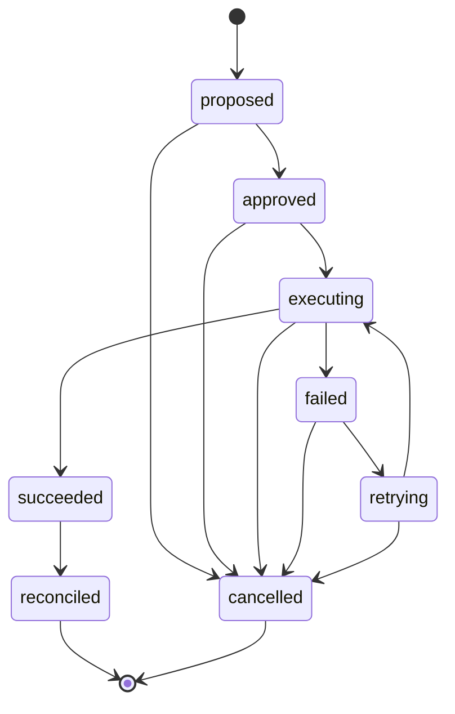

# Action Lifecycle

How GitWire tracks every action from proposal through execution to reconciliation.

## Overview

GitWire's **decide, execute, prove** model requires full lifecycle tracking. Every GitHub mutation — adding a label, creating a PR, approving a review — passes through an **8-state machine** with guard-validated transitions.

The state machine lives in `actionStateMachine.js` and records every state change with timestamps and evidence. This provides:

1. **Auditability** — every action has a complete timeline
2. **Retriability** — failed actions can be retried with automatic child action records
3. **Verifiability** — succeeded actions are periodically reconciled against GitHub's actual state

## State Diagram



## States

| State | Description | Terminal? |
|-------|-------------|:---------:|
| `proposed` | Action created but not yet approved | |
| `approved` | Policy/confidence gate passed, ready to execute | |
| `executing` | API call to GitHub in progress | |
| `succeeded` | Action completed successfully | ✓ |
| `failed` | Action failed, eligible for retry | |
| `retrying` | Preparing a retry attempt (creates child action) | |
| `cancelled` | Action cancelled by user or policy | ✓ |
| `reconciled` | Confirmed still in effect on GitHub | ✓ |

Three states are **terminal** — no further transitions are possible: `succeeded`, `cancelled`, `reconciled`.

## Transitions

Every transition is validated by a guard. Invalid transitions throw an error:

```js
// Example: cannot approve a cancelled action
await approve(cancelledActionId);
// Error: Invalid transition: cancelled → approved. Allowed: 
```

### Happy path

```
propose() → approve() → execute() → succeed()
```

Every worker in GitWire follows this pattern:

```js
const action = await propose({
  repoFullName: "owner/repo",
  pillar: "ci_healing",
  actionType: "create-patch-pr",
  source: "ci_heal:timeout",
  evidence: { run_id: 42, branch: "main", conclusion: "timeout" },
  repoId: 123456,
  targetType: "pr",
  targetNumber: 99,
});

await approve(action.id, { confidence: 0.92, policy: "auto-heal" });
await execute(action.id);

// ... do the GitHub API call ...

await succeed(action.id, { pr_number: 100, pr_url: "https://..." });
```

### Retry path

Failed actions can be retried up to `max_retries` (default: 3). Each retry creates a **child action** linked to the parent:

```
propose() → approve() → execute() → fail()
                                        ↓
                              retry() → new child action (retrying → executing → ...)
```

The child action carries the parent's `action_id` in `parent_action_id` and includes retry metadata in its evidence:

```js
const retryResult = await retry(failedActionId);
if (!retryResult) {
  // Max retries exceeded
}
```

### Reconciliation path

Succeeded actions are periodically verified against GitHub's actual state. If the action's effect is still present, it transitions to `reconciled`:

```
succeed() → [6 hours pass] → reconcile("confirmed")
```

If drift is detected (e.g. a label was removed), the action is still marked `reconciled` but the drift is logged to `action_reconciliation_log`.

## Action Types

Actions are categorized by `action_type` and grouped by `pillar`:

| Pillar | Action Types | Workers |
|--------|-------------|---------|
| `ci_healing` | `create-patch-pr`, `add-label`, `add-comment` | `ciHealWorker` |
| `triage` | `add-label`, `add-comment`, `close-issue` | `triageWorker` |
| `issue_fix` | `create-patch-pr`, `add-comment` | `issueFixWorker` |
| `custom_rules` | `add-label`, `add-comment`, `approve`, `request-review` | `customRulesService` |
| `quality_gates` | `create-check`, `add-comment` | `qualityGateService` |
| `maintainer` | `add-comment`, `close-issue`, `delete-branch` | `maintainerWorker` |

## Evidence

Every action carries an `evidence` JSONB field that accumulates data through the lifecycle:

```json
{
  "run_id": 42,
  "branch": "main",
  "conclusion": "timeout",
  "confidence": 0.92,
  "policy": "auto-heal",
  "pr_number": 100,
  "pr_url": "https://github.com/owner/repo/pull/100"
}
```

Evidence is appended (not replaced) at each transition using JSONB merge:

```sql
evidence = COALESCE(evidence, '{}')::jsonb || $new_evidence::jsonb
```

## Database Schema

### `managed_actions`

| Column | Type | Description |
|--------|------|-------------|
| `id` | BIGSERIAL | Primary key |
| `repo_full_name` | TEXT | "owner/repo" |
| `repo_id` | BIGINT | FK to `repositories.github_id` |
| `pillar` | TEXT | Category: ci_healing, triage, issue_fix, etc. |
| `action_type` | TEXT | Specific action: add-label, create-patch-pr, etc. |
| `source` | TEXT | What triggered this: ai_triage, custom_rule:auto-approve |
| `status` | TEXT | Current state (default: 'succeeded' for legacy rows) |
| `target_type` | TEXT | issue, pr, branch |
| `target_number` | BIGINT | Issue/PR number |
| `evidence` | JSONB | Accumulated context and results |
| `error_message` | TEXT | Failure reason |
| `retries` | INTEGER | Current retry count (default: 0) |
| `max_retries` | INTEGER | Maximum retries allowed (default: 3) |
| `parent_action_id` | BIGINT | FK to parent action (for retries) |
| `proposed_at` | TIMESTAMPTZ | When proposed |
| `approved_at` | TIMESTAMPTZ | When approved |
| `executed_at` | TIMESTAMPTZ | When execution started |
| `resolved_at` | TIMESTAMPTZ | When succeeded/failed/cancelled |
| `reconciled_at` | TIMESTAMPTZ | When reconciled |
| `reconciliation_status` | TEXT | confirmed, drifted |

### `action_reconciliation_log`

| Column | Type | Description |
|--------|------|-------------|
| `id` | BIGSERIAL | Primary key |
| `action_id` | BIGINT | FK to `managed_actions` |
| `check_type` | TEXT | label, pr_state, review, comment, branch |
| `expected` | TEXT | What we expect to see |
| `actual` | TEXT | What we actually found |
| `drifted` | BOOLEAN | Whether drift was detected |
| `checked_at` | TIMESTAMPTZ | When the check ran |

## API

### List actions

```
GET /api/actions?repo=owner/repo&status=failed&pillar=ci_healing&limit=50
```

Returns paginated action list with `{ data: [...], meta: { total, limit, offset } }`.

### Action summary

```
GET /api/actions/summary
```

Returns counts grouped by status:

```json
{
  "summary": [
    { "status": "succeeded", "count": 42 },
    { "status": "failed", "count": 3 }
  ]
}
```

### Single action

```
GET /api/actions/:id
```

Returns full action record including evidence JSON.

### Retry

```
POST /api/actions/:id/retry
```

Creates a child action and transitions it to `retrying`. Returns 400 if max retries exceeded.

### Cancel

```
POST /api/actions/:id/cancel
Body: { "reason": "Superseded by newer action" }
```

Transitions to `cancelled`. Works from any non-terminal state.

### Reconcile

```
POST /api/actions/:id/reconcile
Body: { "status": "confirmed" }
```

Transitions `succeeded` → `reconciled`.

## Reconciliation Worker

The reconciliation worker runs every 6 hours and verifies that succeeded actions are still in effect on GitHub.

### What it checks

| Action Type | Check | Drift condition |
|-------------|-------|-----------------|
| `add-label` | Label still present on issue/PR? | Label removed |
| `remove-label` | Label absent from issue/PR? | Label re-added |
| `create-patch-pr` | PR state | Closed without merge |
| `approve` | Approval still present? | Review dismissed |
| `add-comment` | Always confirmed | N/A (low-stakes) |

### Drift handling

When drift is detected:

1. The check result is logged to `action_reconciliation_log`
2. The action transitions to `reconciled` with `reconciliation_status = "drifted"`
3. No automatic remediation — drift is surfaced for human review via the dashboard

## Dashboard

The **Actions** page (`/actions`) provides:

- **Status filters** — filter by any state (proposed, executing, succeeded, etc.)
- **Repo selector** — view actions for a specific repository
- **Action detail** (`/actions/:id`) — full timeline, evidence JSON, retry/cancel buttons, reconciliation status, parent action chain

## See also

- [Managed Actions](/architecture/managed-actions) — original action tracking (labels, comments, branch refs)
- [Worker Events](/architecture/worker-events) — real-time event bus for worker actions
- [Quality Gates](/configuration/quality-gates) — policy checks that create actions
- [Evidence Bundles](/architecture/evidence-bundles) — how evidence is structured and stored

> **Last validated:** v0.12.1
