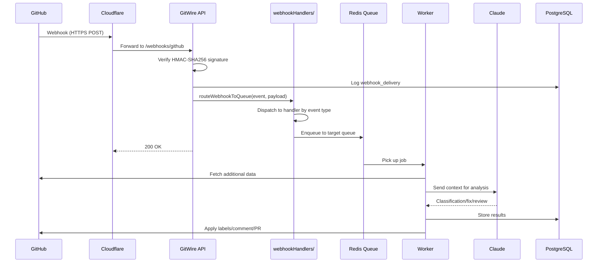
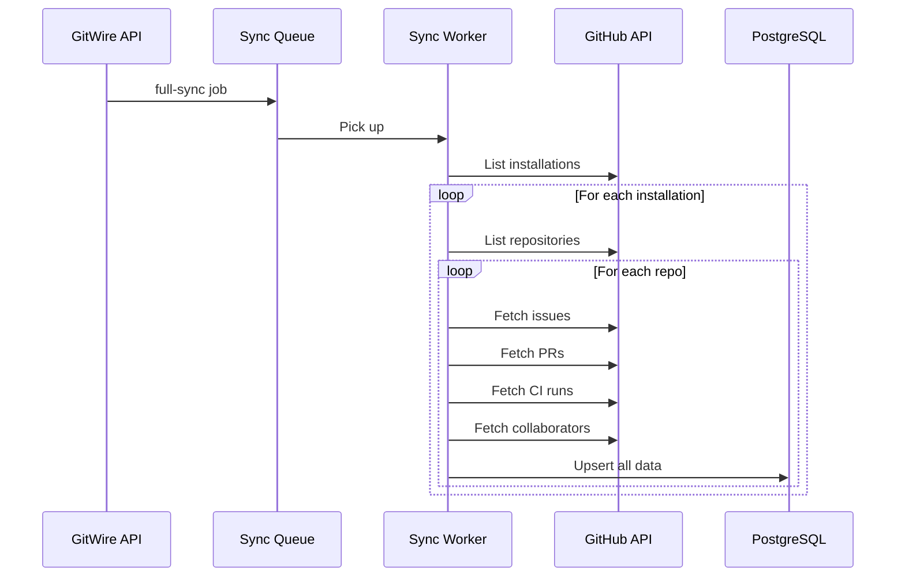
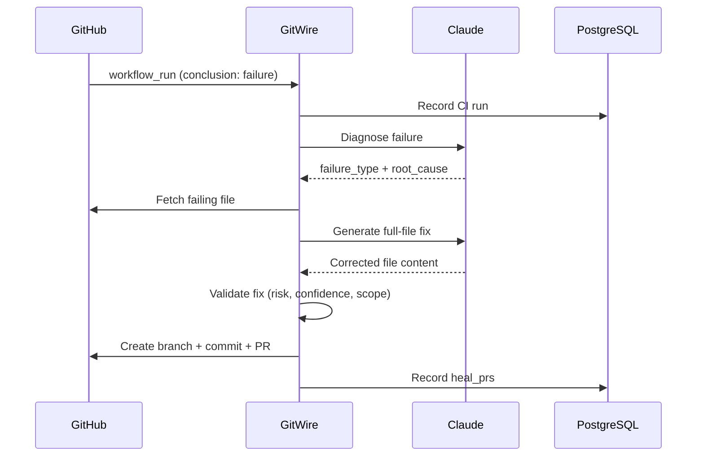
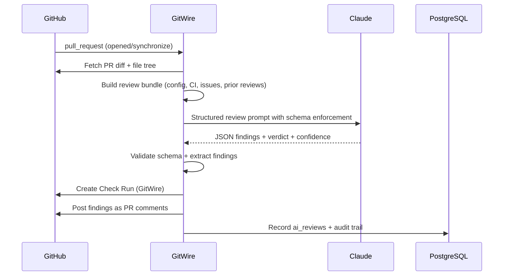
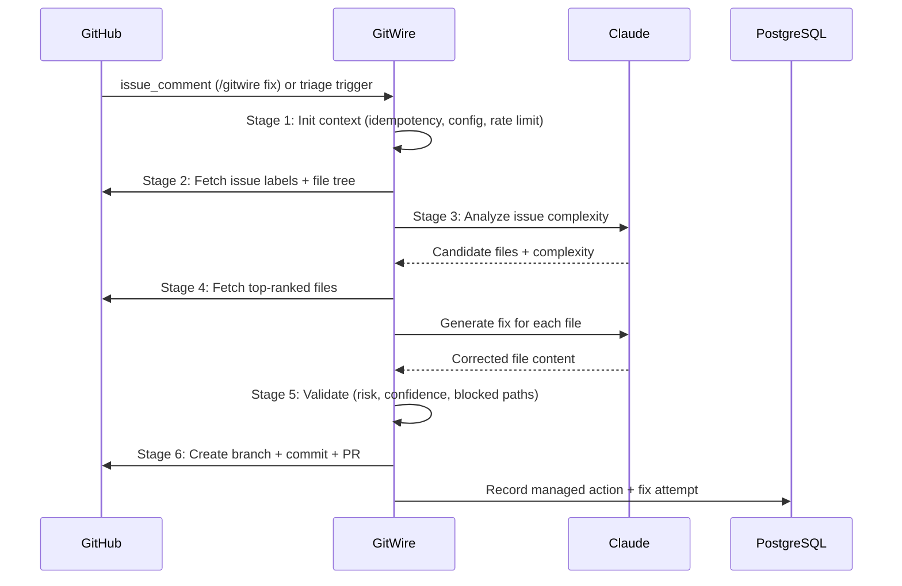

# Data Flow

How data flows through GitWire from GitHub webhook to final action.

## Webhook Processing Flow

## Webhook Routing Detail

The webhook dispatcher (`lib/webhookHandlers/index.js`) uses a handler registry pattern. Each event type maps to a dedicated handler file:

| Event | Handler | Downstream Queue |
|-------|---------|-----------------|
| `issues` (opened, reopened, edited) | `handleIssues.js` | `triage` |
| `pull_request` (opened, reopened, ready_for_review) | `handlePullRequest.js` | `triage`, `phase4` |
| `pull_request` (synchronize) | `handlePullRequest.js` | `phase4` (re-review) |
| `pull_request` (closed) | `handlePullRequest.js` | Reconciliation |
| `workflow_run` (completed, failure) | `handleWorkflowRun.js` | `ci-healing` |
| `workflow_run` (completed, success) | `handleWorkflowRun.js` | `phase2`, test ingestion |
| `check_suite` (completed) | `handleCheckSuite.js` | `phase2` check |
| `issue_comment` (/gitwire commands) | `handleIssueComment.js` | Sub-dispatcher |
| `push` | `handlePush.js` | Config cache invalidation |
| `installation` | `handleInstallation.js` | `sync` |
| Other events | Generic handler | `webhook-events` |

## Sync Flow

## CI Healing Flow

## AI Review Flow

## Issue Fix Pipeline Flow

→ [Security](/architecture/security) | [Webhook Routing](/architecture/webhook-routing) | [Action Lifecycle](/architecture/action-lifecycle)

> **Last validated:** v0.12.1
