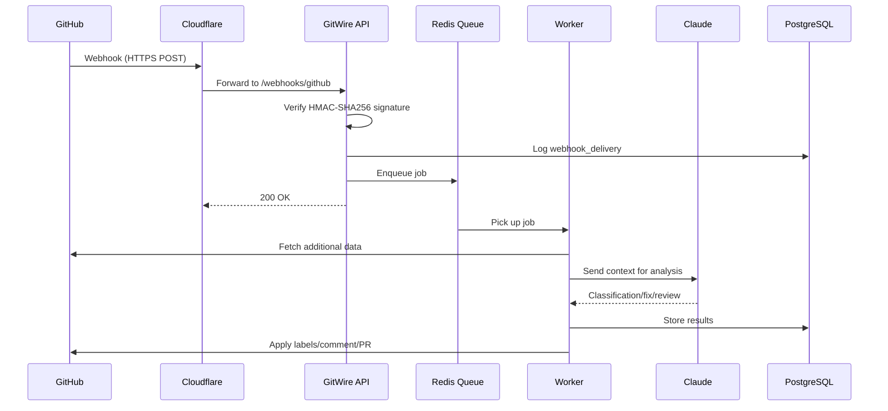
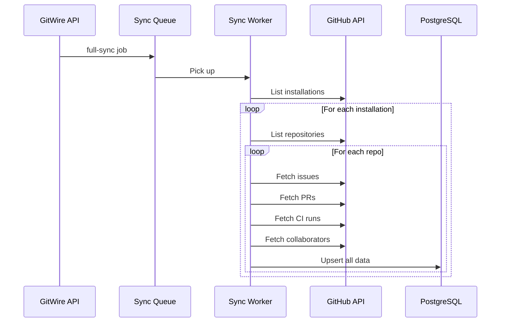
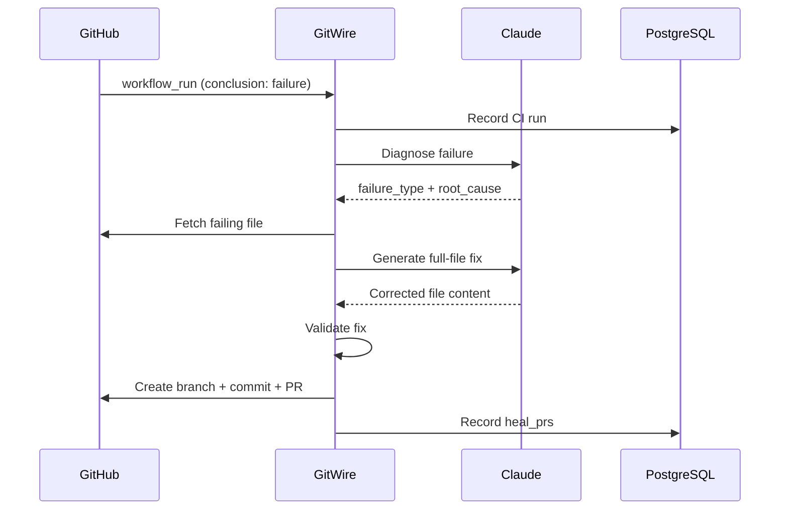
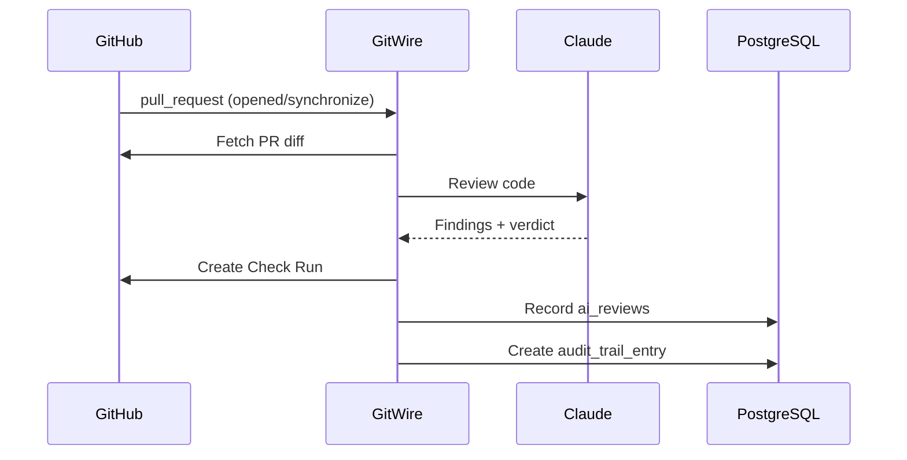

# Data Flow

How data flows through GitWire from GitHub webhook to final action.

## Webhook Processing Flow

## Sync Flow

## CI Healing Flow

## AI Review Flow

→ [Security](/architecture/security)
