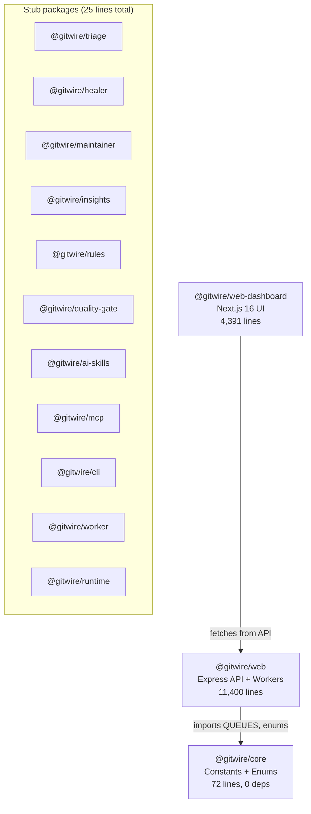
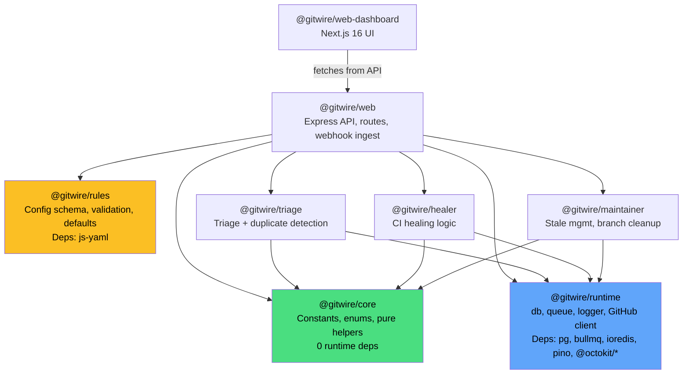

# Package Dependencies

## Current State (v0.6)



## Target State (v0.8+)



## Dependency Inventory

### What lives where today

| Module | Location | Lines | Dependencies |
|--------|----------|-------|--------------|
| Constants/enums | `@gitwire/core` | 72 | None |
| DB client (`db.js`) | `@gitwire/web/src/lib/` | 57 | pg, config, logger |
| Queue factory (`queue.js`) | `@gitwire/web/src/lib/` | 74 | bullmq, ioredis, config, logger, @gitwire/core |
| Logger (`logger.js`) | `@gitwire/web/src/lib/` | 12 | pino, config |
| GitHub client (`github.js`) | `@gitwire/web/src/lib/` | 96 | @octokit/app, @octokit/rest, config, logger |
| Comment router | `@gitwire/web/src/lib/` | 145 | Stays in web (API-surface logic) |
| Config | `@gitwire/web/config/` | 172 | zod, dotenv, fs |

### Extraction blockers

Each `lib/` file imports `config` from `../../config/index.js`. To extract into `@gitwire/runtime`:

1. **Config must become injectable.** Runtime modules should accept config as a constructor/init parameter, not import it directly.
2. **Logger must be created before DB/queue.** Both depend on logger, logger depends on config.
3. **No circular deps.** `@gitwire/core` cannot import from `@gitwire/runtime` (core has zero deps).

### Proposed init pattern

```javascript
// @gitwire/runtime — future API
import { createRuntime } from "@gitwire/runtime";

const { db, logger, redis, createQueue, getInstallationClient } = createRuntime(config);
```

This lets `@gitwire/web` create the runtime with its validated config, then pass it to workers and services.

## Package Role Taxonomy

| Package | Role | Runtime deps | Pure/testable without DB? |
|---------|------|-------------|--------------------------|
| `@gitwire/core` | Constants, enums | None | ✅ Yes |
| `@gitwire/runtime` | DB, queue, logger, GitHub | pg, bullmq, ioredis, pino, @octokit/* | ❌ No — needs Postgres, Redis |
| `@gitwire/rules` | Config schema, validation | js-yaml only | ✅ Yes |
| `@gitwire/triage` | Issue/PR classification | @anthropic-ai/sdk, runtime | ❌ No |
| `@gitwire/healer` | CI failure repair | @anthropic-ai/sdk, runtime | ❌ No |
| `@gitwire/maintainer` | Stale/branch management | runtime | ❌ No |
| `@gitwire/web` | API surface, orchestration | express, helmet, cors, everything | ❌ No |
| `@gitwire/web-dashboard` | Browser UI | next, swr, recharts | ✅ Yes (mock API) |

## Migration Order

1. **v0.7.x** — Decouple config from runtime modules (injectable pattern)
2. **v0.8.0** — Move `db.js`, `queue.js`, `logger.js`, `github.js` to `@gitwire/runtime`
3. **v0.8.1** — Move triage services to `@gitwire/triage`
4. **v0.8.2** — Move healer services to `@gitwire/healer`
5. **v0.8.3** — Move maintainer services to `@gitwire/maintainer`
