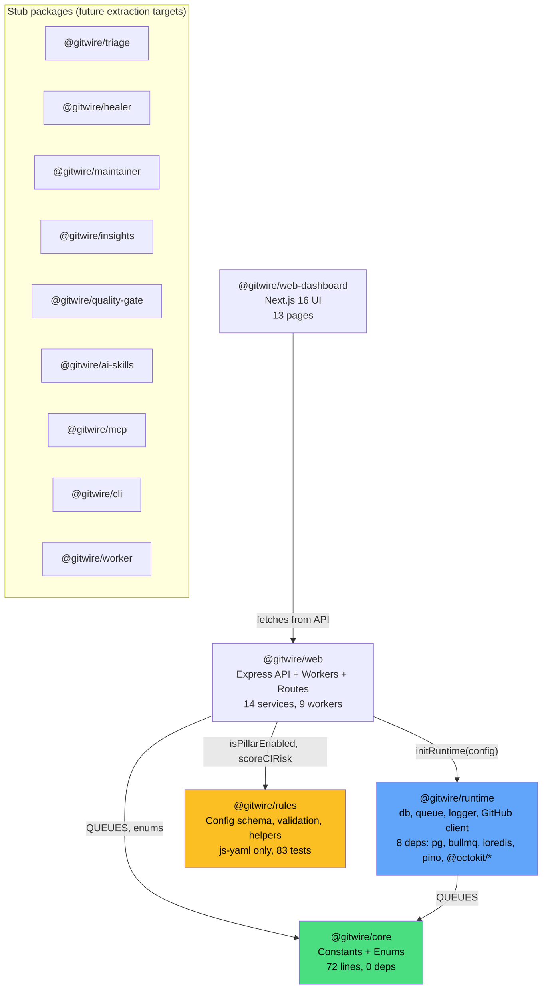

# Package Dependencies

## Current State (v0.8.0)



## @gitwire/runtime Architecture

### Factory Pattern

Each infrastructure module is a factory function that accepts config — no config imports:

| Factory | Accepts | Returns |
|---------|---------|---------|
| `createLogger({ logLevel, env })` | Server config | pino Logger |
| `createDatabase({ url, logger })` | DB URL + logger | `{ query, transaction, end, pool }` |
| `createRedisConnection(url, { logger })` | Redis URL + logger | IORedis instance |
| `createQueue(redis, name)` | Redis + queue name | BullMQ Queue |
| `createWorker(redis, name, processor, opts)` | Redis + processor | BullMQ Worker |
| `createGitHubApp({ appId, privateKey, ... })` | GitHub credentials | `{ getWebhookApp, getInstallationClient, forEachInstallation, forEachRepo }` |

### Init Pattern

```javascript
// Called once at startup (src/index.js)
import { initRuntime } from "@gitwire/runtime";
const runtime = initRuntime(config);  // { logger, db, redis, github, QUEUES }
```

### Compat Layer (backward compatibility)

`compat/` modules provide lazy proxies that delegate to the runtime. This means all 14 existing imports keep working:

```javascript
// Old code still works — zero changes needed
import { db } from "../lib/db.js";
import { logger } from "../lib/logger.js";
import { redis, createQueue, webhookQueue } from "../lib/queue.js";
import { getInstallationClient } from "../lib/github.js";
```

The `lib/*.js` files are now thin re-exports from `@gitwire/runtime/compat/*`.

### Auto-initialization

Workers call `createQueue()` at module top level (before `main()` runs). The compat layer handles this via `ensureRuntime()` which picks up the config set by `config/index.js` through `setConfig()`.

## Dependency Inventory

### What lives where

| Module | Package | Lines | Dependencies |
|--------|---------|-------|--------------|
| Constants/enums | `@gitwire/core` | 72 | None |
| DB client | `@gitwire/runtime` (factory) | 67 | pg |
| Queue factory | `@gitwire/runtime` (factory) | 72 | bullmq, ioredis |
| Logger | `@gitwire/runtime` (factory) | 24 | pino |
| GitHub client | `@gitwire/runtime` (factory) | 91 | @octokit/app |
| Config schema + helpers | `@gitwire/rules` | ~230 | js-yaml |
| Config validation | `@gitwire/web/config/` | 172 | zod, dotenv |
| Services (17) | `@gitwire/web/src/services/` | ~5,000 | runtime, rules, anthropic |
| Workers (9) | `@gitwire/web/src/workers/` | ~3,000 | runtime, rules, services |
| Routes (14) | `@gitwire/web/src/routes/` | ~2,000 | runtime, services |

### Test coverage

| Package | Tests | Type |
|---------|-------|------|
| `@gitwire/core` | — | Constants only |
| `@gitwire/rules` | 83 | Pure unit tests |
| `@gitwire/runtime` | 16 | Factory + init tests |
| `@gitwire/web` | ~395 | Integration, stress, mutation |

## Package Role Taxonomy

| Package | Role | Runtime deps | Pure/testable without DB? |
|---------|------|-------------|--------------------------|
| `@gitwire/core` | Constants, enums | None | ✅ Yes |
| `@gitwire/runtime` | DB, queue, logger, GitHub | pg, bullmq, ioredis, pino, @octokit/* | ❌ No — needs Postgres, Redis |
| `@gitwire/rules` | Config schema, validation, scoring | None | ✅ Yes |
| `@gitwire/web` | API surface, orchestration | express, helmet, cors, everything | ❌ No |
| `@gitwire/web-dashboard` | Browser UI | next, swr, recharts | ✅ Yes (mock API) |

## Future Migration

| Version | Target | Description |
|---------|--------|-------------|
| v0.8.1 | `@gitwire/triage` | Extract triage + duplicate detection services |
| v0.8.2 | `@gitwire/healer` | Extract CI healing services |
| v0.8.3 | `@gitwire/maintainer` | Extract stale/branch management |
