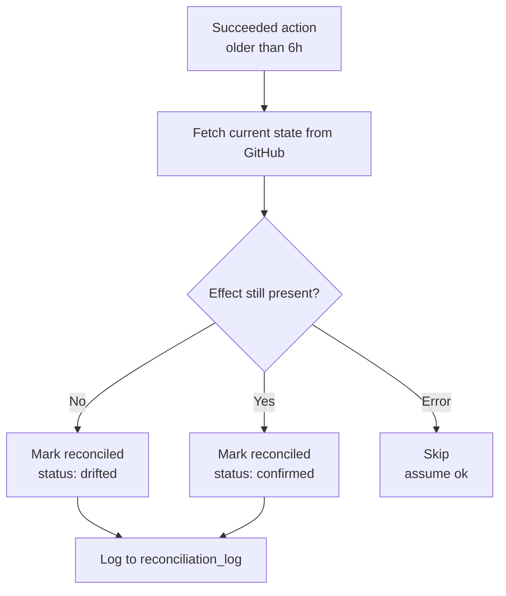

# Reconciliation

How GitWire verifies that its actions are still in effect on GitHub.

## Overview

GitWire's **prove** pillar requires ongoing verification. When GitWire adds a label, approves a PR, or creates a patch, it needs to confirm later that the action's effect persists. This is **reconciliation**.

The reconciliation system has two components:

1. **Periodic scan** — the reconciliation worker checks all `succeeded` actions older than 6 hours
2. **Drift log** — every check is recorded, whether drift is found or not

## When reconciliation runs

| Trigger | Frequency | What it does |
|---------|-----------|--------------|
| Automatic | Every 6 hours | Scans all eligible actions |
| On startup | 5 minutes after boot | Initial scan |
| Manual | `POST /api/actions/:id/reconcile` | Single action |

## Reconciliation flow



## What gets checked

### Labels (`add-label` / `remove-label`)

```js
// Fetch current labels from GitHub
const labels = await octokit.request("GET /repos/{owner}/{repo}/issues/{number}/labels");

// For add-label: expect the label to be present
// For remove-label: expect the label to be absent
const expected = action.action_type === "add-label" ? "present" : "absent";
const actual = labels.some(l => l.name === labelName) ? "present" : "absent";
const drifted = expected !== actual;
```

### PR state (`create-patch-pr`)

```js
const pr = await octokit.request("GET /repos/{owner}/{repo}/pulls/{number}");

// Patch PRs: merged is success, closed-without-merge is drift
if (pr.merged) return { drifted: false };
if (pr.state === "closed" && !pr.merged) return { drifted: true };
// Still open — not drifted yet
```

### Reviews (`approve`)

```js
const reviews = await octokit.request("GET /repos/{owner}/{repo}/pulls/{number}/reviews");

// Check if GitWire's approval is still present
const gitwireApproved = reviews.some(
  r => r.user?.login?.includes("gitwire") && r.state === "APPROVED"
);
const drifted = !gitwireApproved;
```

### Comments (`add-comment`)

Comments are **always confirmed** — they're low-stakes and can't be meaningfully "drifted."

## Drift log

Every reconciliation check is recorded in `action_reconciliation_log`:

| Field | Example | Description |
|-------|---------|-------------|
| `check_type` | `label` | What was checked |
| `expected` | `present` | What we expected to find |
| `actual` | `absent` | What we actually found |
| `drifted` | `true` | Whether they differ |
| `checked_at` | `2026-05-25T12:00:00Z` | When the check ran |

### Drift examples

| Action | Check | Expected | Actual | Drifted? |
|--------|-------|----------|--------|:--------:|
| `add-label:ci-healed` | Label on issue #42 | `present` | `absent` | ✓ |
| `create-patch-pr` | PR #100 state | `merged` | `closed_without_merge` | ✓ |
| `approve` | Review on PR #55 | `APPROVED` | `APPROVED` | |
| `add-label:triaged` | Label on issue #10 | `present` | `present` | |

## No auto-remediation

GitWire does **not** automatically re-apply drifted actions. Drift is surfaced for human review through:

- The **Actions** dashboard page — drifted actions show `reconciliation_status: "drifted"`
- The **reconciliation log** — full history of every check
- Future: Telegram notifications for drifted actions

This is intentional. Drift might be caused by:

- A maintainer intentionally removing a label
- A PR being closed in favor of a different approach
- A review being dismissed during a re-review

Auto-remediation would fight against human decisions. GitWire reports, humans decide.

## Configuration

Reconciliation runs on a fixed schedule (every 6 hours). There is no per-repo configuration.

| Setting | Default | Notes |
|---------|---------|-------|
| Scan interval | 6 hours | Configured in `index.js` |
| Max actions per scan | 100 | Prevents API rate limit exhaustion |
| Max age for eligibility | 6 hours | Only `succeeded` actions older than this are checked |

## See also

- [Action Lifecycle](/architecture/action-lifecycle) — full state machine documentation
- [Managed Actions](/architecture/managed-actions) — action tracking for labels, comments, branch refs
- [Quality Gates](/configuration/quality-gates) — policy checks that produce actions
