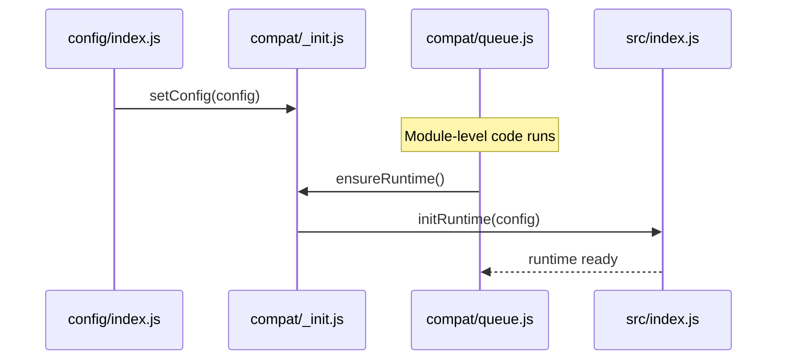
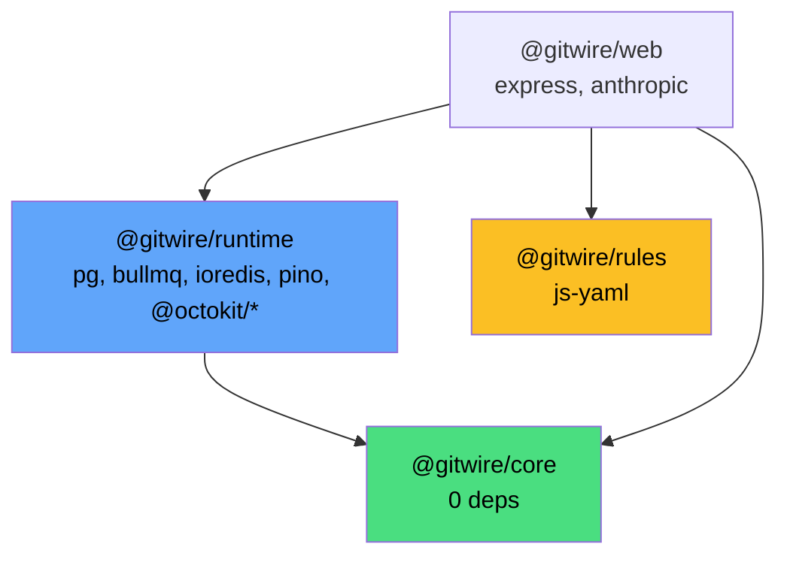

# Runtime Architecture

The `@gitwire/runtime` package provides infrastructure primitives (database, queue, logger, GitHub client) via a **factory + init pattern** with zero config imports.

## Package Layout

```
packages/runtime/
├── src/
│   ├── create-logger.js      # Factory: pino logger
│   ├── create-db.js          # Factory: PostgreSQL pool
│   ├── create-queue.js       # Factory: Redis + BullMQ
│   ├── create-github.js      # Factory: GitHub App client
│   └── index.js              # initRuntime() + getRuntime()
├── compat/
│   ├── _init.js              # Auto-init bridge (setConfig + ensureRuntime)
│   ├── logger.js             # Lazy proxy → runtime.logger
│   ├── db.js                 # Lazy proxy → runtime.db
│   ├── queue.js              # Lazy proxy → runtime.redis + queues
│   └── github.js             # Function delegates → runtime.github
├── tests/
│   └── runtime.test.js       # 16 factory + init tests
└── package.json              # Exports map for compat modules
```

## Factory Pattern

Each infrastructure module is a pure factory function — accepts config params, returns an instance, no imports from `config/`:

```javascript
import { createLogger } from "@gitwire/runtime";

const logger = createLogger({ logLevel: "info", env: "production" });
```

| Factory | Input | Output |
|---------|-------|--------|
| `createLogger({ logLevel, env })` | Server config | pino Logger |
| `createDatabase({ url, logger })` | DB URL | `{ query, transaction, end, pool }` |
| `createRedisConnection(url, { logger })` | Redis URL | IORedis instance |
| `createQueue(redis, name)` | Redis + name | BullMQ Queue |
| `createWorker(redis, name, fn, opts)` | Redis + handler | BullMQ Worker |
| `createGitHubApp({ appId, privateKey, ... })` | Credentials | `{ getWebhookApp, getInstallationClient, ... }` |

## Init Pattern

At startup, `src/index.js` creates all infrastructure from a config object:

```javascript
// packages/web/src/index.js
import { initRuntime, getRuntime } from "@gitwire/runtime";
import { config } from "../config/index.js";

const runtime = initRuntime(config);
// runtime = { logger, db, redis, github, QUEUES }
```

- `initRuntime(config)` — call **once** at startup, creates all singletons
- `getRuntime()` — returns the singleton, throws if not initialized
- `isRuntimeInitialized()` — boolean check
- `resetRuntime()` — clears state (tests only)

## Auto-Initialization

Workers call `createQueue()` at module top level, before `main()` runs:

```javascript
// phase4Worker.js
import { createQueue } from "../lib/queue.js";
export const phase4Queue = createQueue(QUEUES.PHASE4); // ← runs at import time
```

The compat layer handles this via **auto-initialization**:



1. `config/index.js` loads and calls `setConfig(config)`
2. Worker module is imported, `createQueue()` runs
3. `compat/queue.js` calls `ensureRuntime()` on first access
4. If runtime not initialized yet, it calls `initRuntime(config)` automatically
5. Subsequent access returns the cached runtime

## Backward Compatibility

The `@gitwire/web/src/lib/` modules are thin re-exports:

```javascript
// packages/web/src/lib/logger.js
export { logger } from "@gitwire/runtime/compat/logger";
```

All 14 existing imports work unchanged:

```javascript
import { db } from "../lib/db.js";                    // ✅ works
import { logger } from "../lib/logger.js";             // ✅ works
import { redis, createQueue } from "../lib/queue.js";  // ✅ works
import { getInstallationClient } from "../lib/github.js"; // ✅ works
```

## Package Exports

```json
{
  "exports": {
    ".": "./src/index.js",
    "./compat/_init": "./compat/_init.js",
    "./compat/logger": "./compat/logger.js",
    "./compat/db": "./compat/db.js",
    "./compat/queue": "./compat/queue.js",
    "./compat/github": "./compat/github.js"
  }
}
```

## Dependency Graph



→ [Package Dependencies](/architecture/package-dependencies) | [System Architecture](/architecture/system-architecture)
