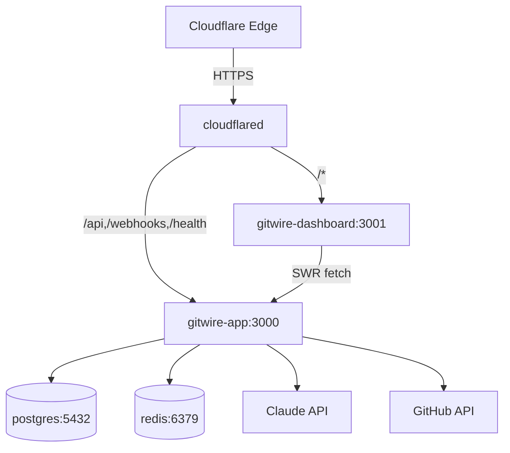

# Architecture Overview

GitWire system architecture and component topology.

## Monorepo Structure

```
GitWire/
├── packages/
│   ├── web/              # Express API + workers (main app)
│   │   ├── src/
│   │   │   ├── app.js           # Express server + route mounting
│   │   │   ├── index.js         # Entry point (starts server + workers)
│   │   │   ├── routes/          # 14 route files, 102 endpoints
│   │   │   ├── services/        # 17 service modules
│   │   │   ├── workers/         # 9 background workers
│   │   │   ├── lib/             # GitHub client, queue, DB helpers
│   │   │   └── middleware/      # Auth, pagination, rate limiting
│   │   └── db/migrations/       # 11 SQL migrations
│   ├── web-dashboard/    # Next.js 16 dashboard
│   │   └── src/
│   │       ├── app/             # 12 pages
│   │       ├── components/      # UI components
│   │       └── lib/             # API client, types
│   └── core/             # @gitwire/core shared constants
│       └── src/index.js         # QUEUES, HEAL_STATUS, etc.
├── docs/                 # VitePress documentation
└── docker-compose.yml
```

## Container Topology



## Service Communication

| From | To | Protocol | Purpose |
|------|----|----------|---------|
| cloudflared | gitwire-app | HTTP | API + webhooks |
| cloudflared | gitwire-dashboard | HTTP | Dashboard UI |
| gitwire-app | postgres | PostgreSQL | Data storage |
| gitwire-app | redis | Redis | Job queues (BullMQ) |
| gitwire-app | Anthropic API | HTTPS | Claude AI calls |
| gitwire-app | GitHub API | HTTPS | Webhooks, data sync |
| gitwire-dashboard | gitwire-app | HTTPS | SWR data fetching |

## Data Flow

See [Data Flow](/architecture/data-flow) for the full webhook-to-action pipeline.

## Security

See [Security](/architecture/security) for authentication, rate limiting, and webhook verification.
