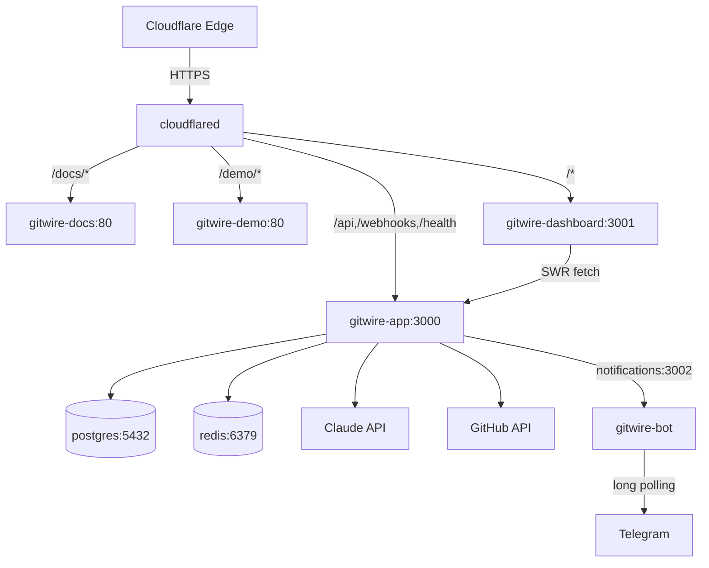

# Architecture Overview

GitWire system architecture and component topology.

## Monorepo Structure (7 Packages)

```
GitWire/
├── packages/
│   ├── web/                    # Express API + workers (main app)
│   │   ├── src/
│   │   │   ├── app.js               # Express server + route mounting
│   │   │   ├── index.js             # Entry point (starts server + workers)
│   │   │   ├── routes/              # 25 route files
│   │   │   ├── services/            # 34 service modules
│   │   │   ├── workers/             # 10 worker processes
│   │   │   │   ├── ciHealWorker.js
│   │   │   │   ├── issueFixWorker.js → issueFix/  # 8-file pipeline
│   │   │   │   ├── maintainerWorker.js → maintainer/commands.js
│   │   │   │   ├── reconciliationWorker.js
│   │   │   │   ├── syncWorker.js
│   │   │   │   ├── triageWorker.js
│   │   │   │   └── phase{2,3,4}Worker.js
│   │   │   ├── lib/
│   │   │   │   ├── webhookHandlers/  # 9 event handlers + 3 comment commands
│   │   │   │   ├── github.js, githubWrapper.js, githubCache.js
│   │   │   │   ├── queue.js, db.js, logger.js
│   │   │   │   └── commentRouter.js
│   │   │   └── middleware/          # Auth, pagination, rate limiting
│   │   └── db/migrations/           # 24 SQL migrations
│   ├── web-dashboard/          # Next.js dashboard
│   │   └── src/
│   │       ├── app/                 # 25 pages
│   │       ├── components/          # Sidebar, panels, icons, UI
│   │       └── lib/                 # API client, types, middleware
│   ├── bot/                    # Telegram bot (grammy)
│   │   └── src/                     # 13 commands, auth, notifications
│   ├── demo-dashboard/         # Static demo site (nginx)
│   │   └── src/app/                 # 15 pages with mock data
│   ├── core/                   # @gitwire/core shared constants
│   │   └── src/index.js             # QUEUES, HEAL_STATUS, enums
│   ├── runtime/                # @gitwire/runtime infrastructure factories
│   │   └── src/ + compat/           # createLogger, createDB, createQueue, createGitHub
│   └── rules/                  # @gitwire/rules config, expression engine, quality gates
│       └── src/                     # Schema, parser, evaluator, plugins, review schema
├── docs/                       # VitePress documentation (118 pages)
├── scripts/                    # Benchmark, migration, backup/restore
└── docker-compose.yml
```

## Container Topology



## Service Communication

| From | To | Protocol | Purpose |
|------|----|----------|----------|
| cloudflared | gitwire-app | HTTP | API + webhooks |
| cloudflared | gitwire-dashboard | HTTP | Dashboard UI |
| cloudflared | gitwire-docs | HTTP | VitePress docs |
| cloudflared | gitwire-demo | HTTP | Static demo dashboard |
| gitwire-app | postgres | PostgreSQL | Data storage |
| gitwire-app | redis | Redis | Job queues (BullMQ) + sessions |
| gitwire-app | Anthropic API | HTTPS | Claude AI calls |
| gitwire-app | GitHub API | HTTPS | Webhooks, data sync |
| gitwire-app | gitwire-bot | HTTP :3002 | Notification bridge |
| gitwire-dashboard | gitwire-app | HTTPS | SWR data fetching |
| gitwire-bot | Telegram | HTTPS | Long polling bot API |

## Data Flow

See [Data Flow](/architecture/data-flow) for the full webhook-to-action pipeline.

## Security

See [Security](/architecture/security) for authentication, rate limiting, and webhook verification.

> **Last validated:** v0.13.0
