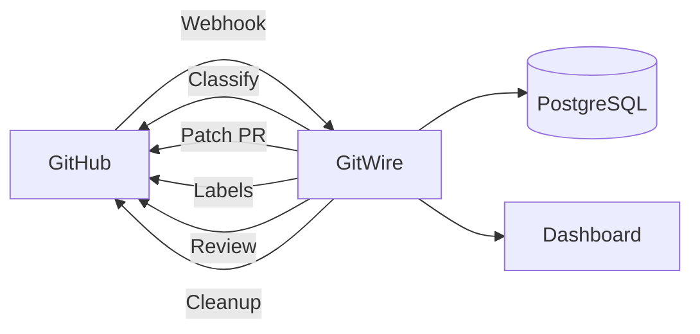

# What is Autonomous GitHub Management?

GitWire represents a shift in how developers manage GitHub repositories — from **manual, reactive** maintenance to **autonomous, proactive** management powered by AI.

## The Problem

Modern development teams juggle dozens of repositories. Each one needs:

- **Issues triaged** — classified, prioritized, deduplicated
- **CI failures resolved** — diagnosed, patched, PR opened
- **Stale items cleaned up** — warned, closed, archived
- **Branches protected** — policies enforced, drift detected
- **Dependencies updated** — vulnerabilities tracked, patches applied
- **Code reviewed** — security, architecture, best practices

Doing this manually across 5, 10, or 50 repos is unsustainable. Most teams just... don't.

## The GitWire Approach

GitWire runs as a **self-hosted GitHub App** that connects to your repositories and automates these tasks using AI (Claude). It doesn't replace developers — it handles the repetitive, time-consuming work so developers can focus on building.

### Three Principles

1. **Self-hosted, not SaaS** — Your code, your data, your infrastructure. GitWire runs on your server, behind your firewall. No third-party sees your code.

2. **AI-assisted, not AI-autonomous** — GitWire takes action, but with guardrails. Duplicate issues are labeled but never auto-closed. AI fixes are PRs, not direct commits. Maintainers always have the final say.

3. **Transparent, not magical** — Every action is logged. Every AI decision is recorded. The audit trail is SHA-256 chained and tamper-proof. You can always see what GitWire did and why.

## The 8 Pillars

GitWire organizes its capabilities into 8 pillars, each solving a specific pain point:

| Pillar | Pain Point | GitWire Solution |
|--------|-----------|------------------|
| **Issue & PR Triage** | New issues pile up unclassified | Claude auto-classifies by type, priority; detects duplicates |
| **Self-Healing CI** | CI failures sit unaddressed for hours | Claude diagnoses the failure, generates a patch PR |
| **Autonomous Contributor** | Simple bugs linger because no one has time | Claude reads the issue, generates a full fix PR |
| **Maintainer Tools** | Stale issues and dead branches accumulate | Automated stale scanner, branch cleanup, governance sync |
| **Multi-Repo Insights** | No visibility across the fleet | Real-time dashboard with health metrics, CI trends |
| **Branch Enforcement** | Branch protection is inconsistent | Policy-as-code with drift detection and auto-remediation |
| **Merge Queue** | Merges are chaotic, rollbacks painful | Ordered queue with error recovery and feedback rules |
| **AI Review Gate** | Security issues slip through review | Pre-merge AI review with secret detection and audit trail |

## When to Use GitWire

::: tip Good fit for GitWire
- Teams managing **5+ repositories**
- Projects with **frequent issues and CI failures**
- Maintainers who spend **hours per week on triage**
- Organizations needing **compliance audit trails**
- Teams wanting **consistent branch protection** across repos
:::

::: warning Not ideal for GitWire
- A single personal repo with few issues
- Teams that prefer fully manual control over every action
- Projects where AI-generated code changes are not acceptable
:::

## How It Differs from Traditional CI/CD

| Aspect | Traditional CI/CD | GitWire |
|--------|-------------------|---------|
| **Issue management** | Manual labeling | AI auto-triage + deduplication |
| **CI failures** | Dev fixes manually | AI diagnoses + opens patch PR |
| **Stale items** | Forgotten | Automated warn + close lifecycle |
| **Branch protection** | Manual per-repo config | Policy-as-code, auto-enforced |
| **Code review** | Peer review only | AI pre-review for security + quality |
| **Audit trail** | None or manual | Immutable SHA-256 chain |
| **Cross-repo visibility** | None | Fleet-wide dashboard |

## Data Flow

## What GitWire Is NOT

- **Not a CI/CD runner** — It doesn't run your tests or builds (GitHub Actions does that)
- **Not a code hosting platform** — It manages repos on GitHub, doesn't replace it
- **Not a chat bot** — It operates through webhooks and scheduled jobs, not chat commands
- **Not a SaaS product** — It's self-hosted open source (MIT license)

## Next Steps

→ [Install GitWire](/installation/prerequisites)
→ [See the 8 Pillars in action](/guides/first-triage)
→ [Read the API Reference](/api/rest-api-reference)
