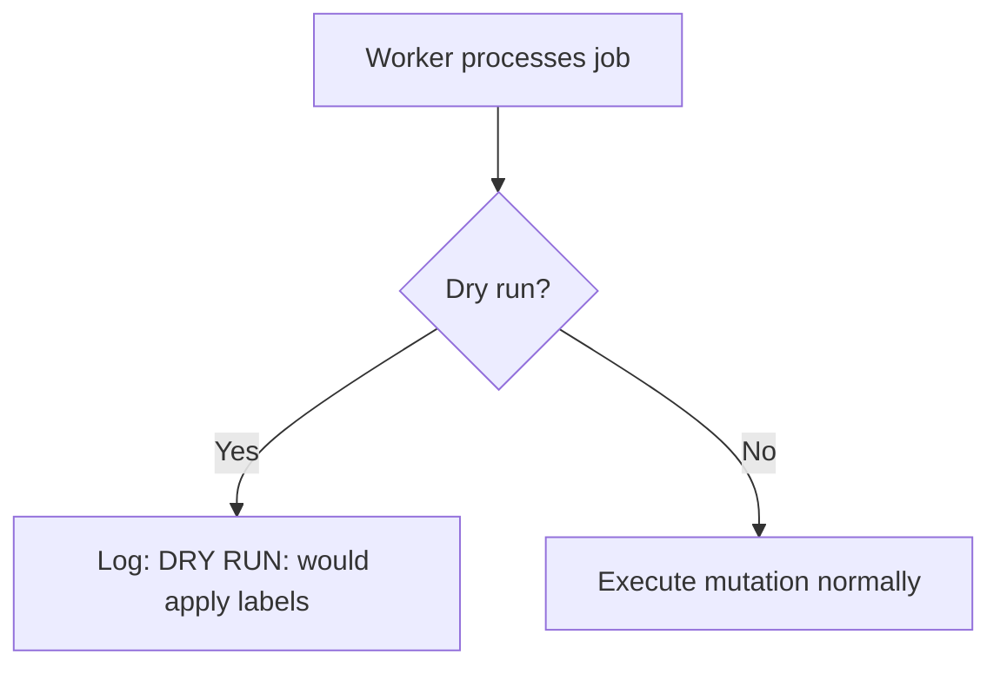
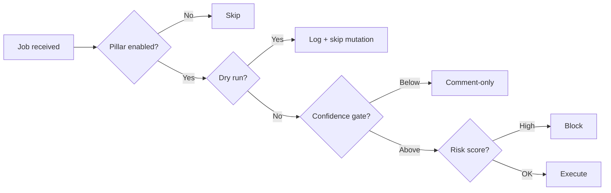

# Dry Run Mode

Dry run mode lets you test GitWire's behavior **without executing any mutations**. All AI analysis runs normally, but GitHub API calls that modify state (labels, comments, PRs, branches) are intercepted and logged.

## How It Works

Every worker checks `isDryRun(repoConfig)` before each mutation:



| Worker | What's Intercepted |
|--------|-------------------|
| **triageWorker** | Label application, triage comments |
| **ciHealWorker** | Workflow re-run, patch PR creation |
| **issueFixWorker** | Entire PR pipeline (branch, commit, PR) |
| **maintainerWorker** | Stale warn/close comments, branch deletion |
| **phase2Worker** | Merge queue processing |
| **phase4Worker** | AI review execution |

## Enabling Dry Run

### Option 1: `.gitwire.yml`

```yaml
settings:
  dry_run: true
```

### Option 2: Dashboard UI

Navigate to **Config** → select a repo → scroll to **Settings** section → toggle **Dry Run Mode**.

A yellow banner appears at the top of the config page when dry run is active:

> ⚠️ **Dry Run Mode** — No mutations will be executed for this repo.

### Option 3: API

```bash
# Enable
curl -X PATCH https://gitwire.example.com/api/config/org/repo \
  -H "Authorization: Bearer $API_KEY" \
  -H "Content-Type: application/json" \
  -d '{"settings":{"dry_run":true}}'

# Disable
curl -X DELETE https://gitwire.example.com/api/config/org/repo
```

## What Gets Logged

In dry run mode, workers produce detailed logs of what they **would** do:

```
INFO  DRY RUN: would apply labels ["bug","priority:high"] to org/repo#42
INFO  DRY RUN: would post triage comment on org/repo#42
INFO  DRY RUN: would create patch PR for org/repo run 12345 (test_flaky)
INFO  DRY RUN: would warn stale issue org/repo#38 (30 days old)
INFO  DRY RUN: would close stale PR org/repo#15 (90 days old)
INFO  DRY RUN: would delete branch org/repo:feature/old-branch
```

The maintainer worker records skipped actions with `"status": "skipped"` in the stale management audit log for traceability.

## Use Cases

| Scenario | How |
|----------|-----|
| **Trial run** | Enable dry run, push some issues/PRs, review logs, disable |
| **Per-repo testing** | Enable for one repo while others run normally |
| **Pre-deployment validation** | Enable before upgrading, verify behavior, disable |
| **Demo mode** | Show what GitWire would do without side effects |

## Combining with Risk Scoring

Dry run and risk scoring are independent layers:



Dry run is checked **first**, so it overrides all downstream logic including risk scoring.

→ [Policy-as-Code](/configuration/policy-as-code) | [Risk Scoring](/configuration/risk-scoring) | [Config API](/api/config-api)
