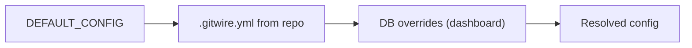

# Policy-as-Code (`.gitwire.yml`)

GitWire uses a **policy-as-code** approach. Each repository can define a `.gitwire.yml` file at its root to control which GitWire features are active and how they behave.

## How it works



Resolution order (last wins):

1. **`DEFAULT_CONFIG`** — built-in defaults from `@gitwire/rules`
2. **`.gitwire.yml`** — fetched from the repository's default branch, cached for 5 minutes
3. **Database overrides** — set via the dashboard `/config` page or API

## Minimal Example

```yaml
# .gitwire.yml
pillars:
  triage:
    enabled: true
    auto_label: true
    auto_comment: true
    duplicate_detection: true
  ci_healing:
    enabled: true
    auto_patch: true
```

## Full Reference

```yaml
# .gitwire.yml — Full configuration reference
pillars:
  # ── Issue & PR Triage ───────────────────────────────────────────
  triage:
    enabled: true
    auto_label: true          # Apply classification labels
    auto_comment: true        # Post triage summary comment
    duplicate_detection: true # Check for duplicate issues

  # ── Self-Healing CI ─────────────────────────────────────────────
  ci_healing:
    enabled: true
    auto_patch: true
    max_fix_attempts: 3
    min_confidence_to_patch: medium   # low | medium | high
    allowed_file_patterns: ["**"]
    blocked_file_patterns:
      - ".env*"
      - "secrets/**"
      - "*.pem"
      - "*.key"

  # ── Autonomous Contributor ─────────────────────────────────────
  issue_fix:
    enabled: false            # Opt-in only — autonomous fixes are destructive
    max_file_changes: 3
    max_line_changes: 200
    min_confidence_to_submit: medium   # low | medium | high
    allowed_labels:
      - bug
      - fix
      - help wanted
      - good first issue
    blocked_paths:
      - "secrets/**"
      - "*.env"
      - "*.pem"
      - "*.key"
      - "package-lock.json"
      - "yarn.lock"

  # ── Maintainer Tools ───────────────────────────────────────────
  maintainer:
    enabled: true
    stale:
      issues:
        warn_days: 30
        close_days: 90
      pull_requests:
        warn_days: 60
        close_days: 180
      exempt_labels:
        - pinned
        - security
        - "keep-alive"
    branch_cleanup:
      enabled: true
      exclude_patterns:
        - "main"
        - "master"
        - "develop"
        - "release/*"

  # ── Multi-Repo Insights ────────────────────────────────────────
  insights:
    enabled: true

  # ── Branch Enforcement ─────────────────────────────────────────
  enforcement:
    enabled: true

  # ── Merge Queue ────────────────────────────────────────────────
  merge_queue:
    enabled: true

  # ── AI Review Gate ─────────────────────────────────────────────
  ai_review:
    enabled: true
    comment_findings: true    # Post review comments on PRs

# ── Global Settings ──────────────────────────────────────────────
settings:
  dry_run: false              # Log mutations without executing
```

## Pillar Enable/Disable

Each pillar has an `enabled` flag. When `false`:

- The worker skips processing for that repo
- No GitHub API calls are made
- No AI prompts are sent
- Config guards log: `"Pillar <name> disabled for <repo>"`

## Blocked Paths

`blocked_file_patterns` and `blocked_paths` use glob patterns via [minimatch](https://www.npmjs.com/package/minimatch):

```yaml
blocked_paths:
  - "secrets/**"        # Any file under secrets/
  - "*.env"             # Any .env file at any depth
  - "config/prod*"      # Production config files
```

When a blocked path is detected:
- CI Healing: posts diagnosis comment but **skips patch PR**
- Issue Fix: **rejects the fix entirely** with explanation comment

## Cache Invalidation

The `.gitwire.yml` is cached in Redis for 5 minutes. Cache is automatically invalidated when:

- A `push` event modifies `.gitwire.yml` in the default branch
- Config overrides are updated via API or dashboard

## File Not Found

If a repository doesn't have `.gitwire.yml`, GitWire uses `DEFAULT_CONFIG`. This means **all pillars are enabled** with safe defaults. No `.gitwire.yml` is required.

→ [Config API Reference](/api/config-api) | [Risk Scoring](/configuration/risk-scoring) | [Dry Run Mode](/configuration/dry-run)
