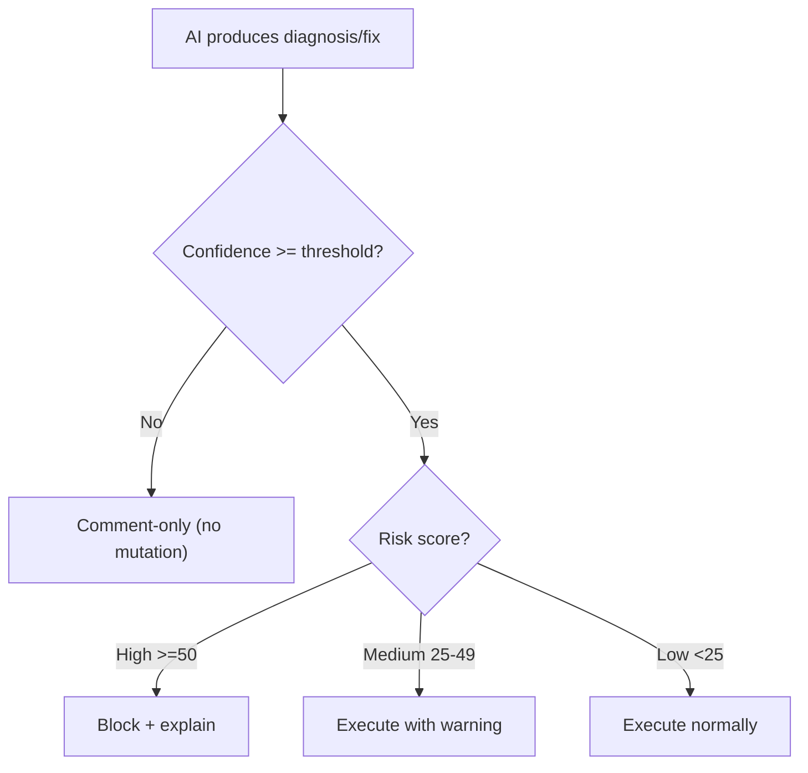

# Risk Scoring

Every AI action in GitWire is **scored** before execution. Low-confidence and high-risk actions are blocked or downgraded automatically.

## How It Works



## CI Healing Risk Scoring

When a CI run fails and Claude diagnoses it, the diagnosis is scored:

| Factor | Points | When Applied |
|--------|--------|-------------|
| Low AI confidence | +40 | `confidence: "low"` |
| Medium AI confidence | +15 | `confidence: "medium"` |
| High-risk failure type | +30 | `infra_error`, `build_error`, `unknown` |
| Other failure type | +15 | `test_flaky`, `dependency_missing`, etc. |
| No failing file identified | +20 | `failing_file: null` |
| Not auto-fixable | +30 | `auto_fixable: false` |

### Risk Levels

| Score | Level | Action |
|-------|-------|--------|
| 0–24 | **Low** | Patch PR created normally |
| 25–49 | **Medium** | Patch PR created, warning logged |
| 50–100 | **High** | **Blocked** — only diagnosis comment posted |

### Confidence Gate

Before risk scoring, the confidence gate checks:

```yaml
pillars:
  ci_healing:
    min_confidence_to_patch: medium  # low | medium | high
```

If Claude's confidence is below the threshold, no patch is attempted. Instead, a **comment-only diagnosis** is posted to the commit/PR:

> 🤖 **GitWire CI Diagnosis** (confidence: low, threshold: medium)
>
> Confidence below threshold — posting diagnosis only.
> Adjust `ci_healing.min_confidence_to_patch` in `.gitwire.yml` if needed.

## Issue Fix Risk Scoring

When the autonomous contributor analyzes an issue and produces a fix:

| Factor | Points | When Applied |
|--------|--------|-------------|
| Complex issue | +40 | `complexity: "complex"` |
| Moderate complexity | +20 | `complexity: "moderate"` |
| >3 files changed | +20 | Multi-file fix |
| >30% line delta | +15 | Large changes relative to file size |

### Pre-Check

Complexity is mapped to confidence:

| Complexity | Confidence |
|-----------|-----------|
| trivial | high |
| simple | medium |
| moderate / complex | low |

If this confidence is below `min_confidence_to_submit`, the fix is **rejected before PR creation**.

### High-Risk Block

Fixes scoring ≥ 50 are blocked with a detailed rejection:

> 🚫 **GitWire Fix — high risk**
>
> Risk score: **65/100**
> - Complex issue
> - 4 files changed
> - src/app.js: 45% lines changed
>
> _This fix is too risky for autonomous submission._

## Configuration

### `.gitwire.yml`

```yaml
pillars:
  ci_healing:
    min_confidence_to_patch: high    # Only high-confidence patches
  issue_fix:
    min_confidence_to_submit: low    # Allow low-confidence attempts
```

### Dashboard UI

Navigate to **Config** → select a repo → find the **CI Healing** or **Autonomous Contributor** card → adjust **Min confidence (1-3)**:

| Value | Meaning |
|-------|---------|
| 1 (low) | All AI actions allowed |
| 2 (medium) | Block low-confidence (default) |
| 3 (high) | Only high-confidence actions |

### API

```bash
PATCH /api/config/:owner/:repo
{
  "pillars": {
    "ci_healing": { "min_confidence_to_patch": "high" },
    "issue_fix": { "min_confidence_to_submit": "low" }
  }
}
```

## Audit Trail

All risk assessments are logged:

```json
{
  "level": 30,
  "msg": "CI risk assessment",
  "runId": 12345,
  "riskScore": 55,
  "riskLevel": "high",
  "minConfidence": "medium"
}
```

```json
{
  "level": 30,
  "msg": "Fix risk assessment",
  "repo": "org/repo",
  "issueNumber": 42,
  "riskScore": 65,
  "riskLevel": "high",
  "reasons": ["Complex issue", "4 files changed"]
}
```

→ [Policy-as-Code](/configuration/policy-as-code) | [Dry Run Mode](/configuration/dry-run) | [CI Healing](/pillars/ci-healing/self-healing-ci)
