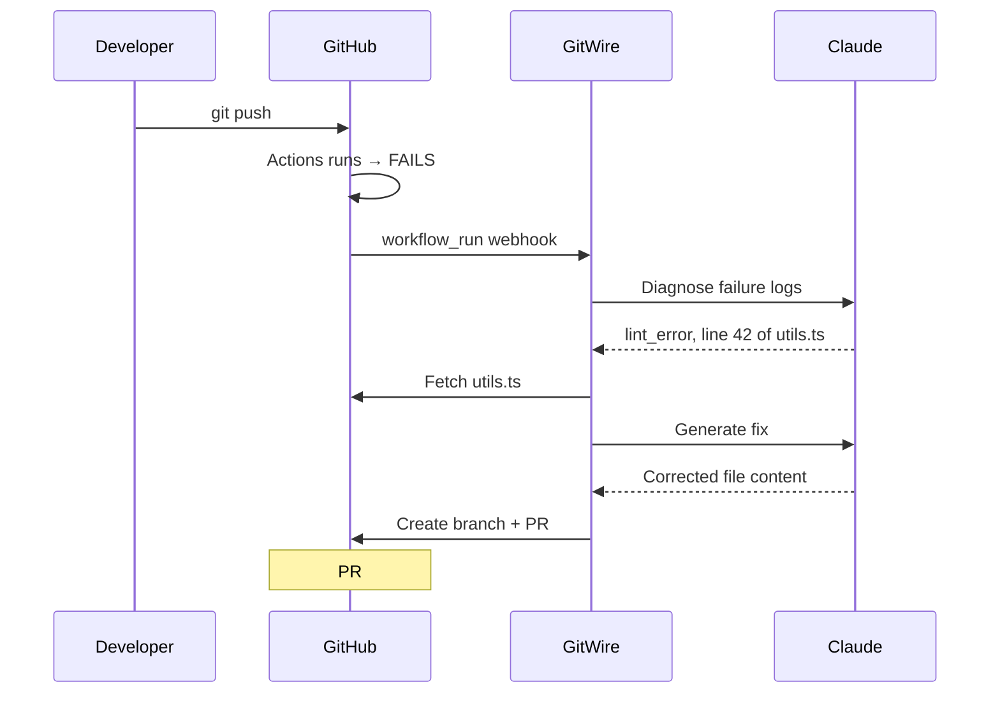

# Full Walkthrough: From Empty Repo to Fully Managed

A complete, real-world walkthrough showing GitWire managing a repository from scratch.

## Scenario

You've just created a new repository called `acme/webapp` and installed GitWire. Let's watch it work.

## Step 1: The Sync

After installing the GitHub App on `acme/webapp`:

1. GitHub sends an `installation_repositories` webhook
2. GitWire's **Sync Worker** picks up the job
3. Fetches repo metadata, open issues, PRs, CI runs
4. Everything lands in the database

```bash
# Check that the repo was synced
curl https://gitwire.yourdomain.com/api/repos/acme/webapp \
  -H "Authorization: Bearer YOUR_API_KEY"
```

You see your repo with `last_synced_at` populated.

## Step 2: First Issue Gets Triaged

Someone opens an issue:

> **Title:** "Login button doesn't respond on mobile Safari"
> **Labels:** None

::: tip What happens automatically
1. GitHub sends `issues` webhook → GitWire queues a triage job
2. Claude reads the issue title and classifies it:
   - **Type:** `bug`
   - **Priority:** `high`
   - **Summary:** "Login button unresponsive on mobile Safari browser"
3. GitWire applies labels on GitHub: `bug`, `priority: high`
4. Dashboard updates within 30 seconds
:::

Check it:

```bash
curl https://gitwire.yourdomain.com/api/issues/acme/webapp \
  -H "Authorization: Bearer YOUR_API_KEY"
```

You see `triage_type: "bug"`, `triage_priority: "high"`.

## Step 3: Duplicate Gets Flagged

Someone else opens:

> **Title:** "Can't log in on iPhone"

GitWire's duplicate detection kicks in:

1. Generates a 512-dim embedding for this issue
2. Compares against all existing issues in `acme/webapp`
3. Finds **0.94 similarity** with the first issue
4. Labels it `duplicate`, posts a comment linking to the original

The dashboard shows a `pending` duplicate signal. A maintainer confirms it.

## Step 4: CI Run Fails

You push a commit that breaks a lint check. GitHub Actions fails.



You get a PR within 2 minutes. The PR body explains what was wrong and what was fixed. You review, approve, merge.

## Step 5: A Bug Gets Auto-Fixed

Issue #5 is labeled `bug` and `help wanted`:

> **Title:** "Null reference when user profile is missing email"

The **Autonomous Contributor** picks it up:

1. **Pass 1**: Claude reads the issue, identifies `src/profile.ts` as the target file
2. **Pass 2**: Fetches the file, generates a fix adding a null check
3. **Validation**: Non-empty ✅, line delta OK ✅, syntax balanced ✅
4. **PR created**: `gitwire/fix-5` with the null check added

You review the PR. It's a 2-line change. You merge it.

## Step 6: Stale Issues Get Cleaned Up

30 days pass. Two issues haven't been updated. GitWire's **Stale Scanner** runs:

1. Finds issue #3 (no activity for 30 days)
2. Posts a warning comment: *"This issue has been inactive for 30 days. It will be closed in 7 days unless updated."*
3. Adds `stale` label
4. Records the action with idempotency key `stale-warn-12345-issue-3`

7 days later, no activity. GitWire closes it.

## Step 7: Branch Protection Enforced

You create an enforcement policy:

```bash
curl -X POST https://gitwire.yourdomain.com/api/enforcement/policies \
  -H "Authorization: Bearer YOUR_API_KEY" \
  -H "Content-Type: application/json" \
  -d '{
    "name": "protect-main",
    "branch_pattern": "main",
    "min_reviews": 1,
    "require_status_checks": true,
    "required_status_check_contexts": ["ci/test"],
    "mode": "enforce"
  }'
```

GitWire's reconciler:
1. Checks all repos matching the policy
2. Finds `acme/webapp` has no branch protection on `main`
3. Creates GitHub branch protection rule via API
4. Records the reconciliation run

## Step 8: AI Reviews a PR

A contributor opens PR #15 that adds a new API endpoint. GitWire's **AI Review Gate**:

1. Fetches the PR diff
2. Claude reviews it and finds:
   - 🔴 **Critical**: Hardcoded API key in `src/config.ts`
   - 🟡 **Medium**: Missing error handling for null response
   - 🟢 **Info**: Consider using `const` instead of `let`
3. Creates a **GitHub Check Run** with verdict: `request_changes`
4. Creates a **PR Review** with inline comments
5. Records the review in the **audit trail** with SHA-256 hash

The contributor sees the check failed, removes the API key, and pushes again. Second review: `approved` ✅.

## Step 9: Compliance Report

End of quarter. You generate a SOC2 report:

```bash
curl -X POST https://gitwire.yourdomain.com/api/audit/reports \
  -H "Authorization: Bearer YOUR_API_KEY" \
  -H "Content-Type: application/json" \
  -d '{
    "report_type": "soc2",
    "period_start": "2026-01-01T00:00:00Z",
    "period_end": "2026-03-31T23:59:59Z"
  }'
```

The report covers 847 audit entries, all chain-verified, mapped to SOC2 controls.

## The Result

In one quarter, GitWire autonomously:

| Action | Count |
|--------|-------|
| Issues triaged | 42 |
| Duplicates detected | 8 |
| CI failures healed | 12 |
| Bug fix PRs generated | 5 |
| Stale issues closed | 15 |
| Branch policies enforced | 3 repos |
| Security issues caught | 2 |
| Audit entries recorded | 847 |

**Developer time saved: ~20 hours/quarter.**

→ [Try it yourself — First Triage Guide](/guides/first-triage)
