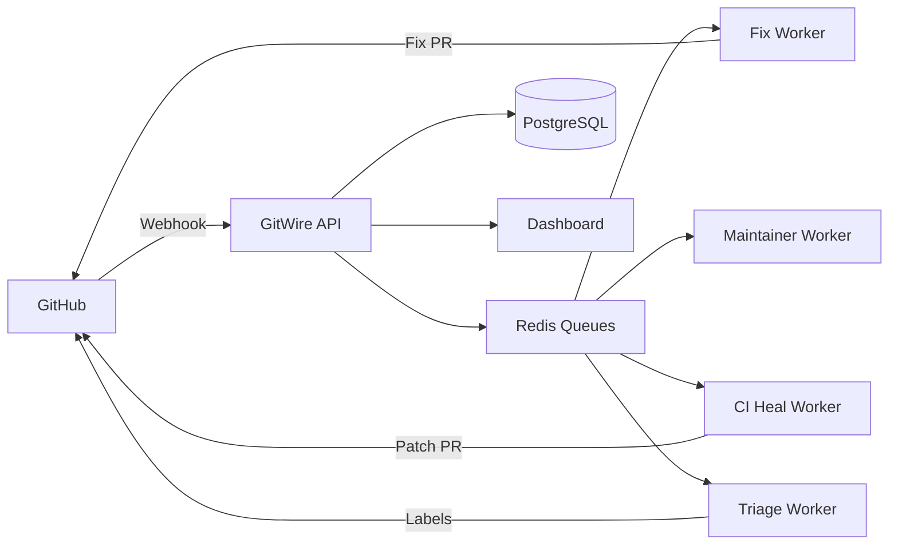

## What is GitWire?

GitWire is a self-hosted GitHub App that runs on your infrastructure. It connects to your GitHub account via a GitHub App and uses AI (Claude) to automate repository management tasks.

## Quick Numbers

| Metric | Count |
|--------|-------|
| Pillars | 8 |
| API Endpoints | 102 |
| Database Tables | 36 |
| Background Workers | 9 |
| Dashboard Pages | 12 |

## Tech Stack

- **Backend**: Node.js + Express + PostgreSQL 16 + Redis 7 + BullMQ
- **AI**: Claude (Anthropic API)
- **Frontend**: Next.js 16 + Tailwind CSS + SWR + Recharts
- **Deploy**: Docker Compose (5 containers)
- **Expose**: Cloudflare Tunnel (outbound-only, works behind NAT)

## Architecture Overview

## Get Started

Head to the [Installation Guide](/installation/prerequisites) to set up GitWire, or jump straight to a specific pillar from the sidebar.
