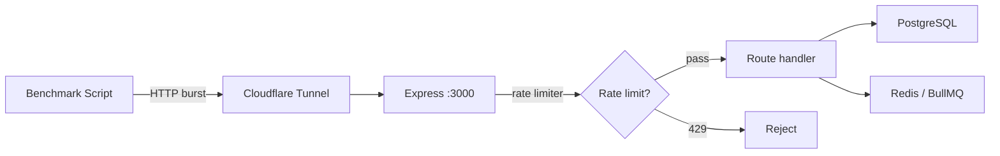

# Benchmark Harness

Measuring GitWire's production performance — webhook RPS, queue throughput, API p95 latency.

## Overview

GitWire ships with a built-in benchmark harness at `scripts/benchmark.js` that measures real production performance. It runs against a live GitWire instance (local or remote) and reports:

- **API latency** — per-endpoint p50/p90/p95/p99 response times
- **Webhook ingestion** — throughput for synthetic push events
- **Queue throughput** — BullMQ job enqueue rate
- **Mixed workload** — realistic combination of reads and writes

## Usage

```bash
# Full benchmark suite
npm run benchmark

# Individual benchmarks
npm run benchmark:api
npm run benchmark:webhook

# Custom parameters
node scripts/benchmark.js --iterations 500 --concurrency 20

# Custom target
GITWIRE_BASE_URL=http://localhost:3000 node scripts/benchmark.js --api
```

### CLI flags

| Flag | Description | Default |
|------|-------------|---------|
| `--api` | API latency benchmark only | — |
| `--webhook` | Webhook ingestion only | — |
| `--queue` | Queue throughput only | — |
| `--iterations N` | Requests per benchmark | 200 |
| `--concurrency N` | Max concurrent requests | 10 |
| `--api-key KEY` | API key for auth | `API_KEY` env |

## Production numbers

Benchmarks run against `gitwire.erlab.uk` via Cloudflare Tunnel (RTT ~130ms).

### Health endpoint (no rate limit)

| Metric | Value |
|--------|-------|
| p50 | 134 ms |
| p95 | 143 ms |
| p99 | 146 ms |
| RPS | 7.5 |

### Webhook ingestion (no rate limit on /webhooks)

| Metric | Value |
|--------|-------|
| p50 | 138 ms |
| p95 | 146 ms |
| p99 | 152 ms |
| RPS | 7.3 |

### API endpoints (rate-limited: 100 req/min)

| Endpoint | p95 | Notes |
|----------|-----|-------|
| `GET /api/repos` | 162 ms | Heavy query with CI stats |
| `GET /health` | 143 ms | Lightweight |
| `POST /webhooks/github` | 146 ms | Signature verify + enqueue |

### Mixed workload

| Metric | Value |
|--------|-------|
| p50 | 139 ms |
| p95 | 156 ms |
| p99 | 168 ms |
| RPS | 7.1 |

### Performance breakdown

The ~135ms baseline is dominated by the **Cloudflare Tunnel round-trip** (~120ms). Actual Express processing time is 5–30ms on top of that:

```
Client → Cloudflare Edge → Tunnel → Express → PostgreSQL → Response
  ~60ms      ~30ms         ~10ms     ~5-30ms      ~1-5ms
```

## Rate limiting

The production rate limiter is set to **100 requests per minute per IP**. The health endpoint (`/health`) and webhook endpoint (`/webhooks/*`) are exempt.

When benchmarking, the harness automatically throttles to stay under the limit. For raw performance numbers without the rate limiter, run directly against the Express backend:

```bash
# Port-forward to the Docker container
ssh -L 3000:localhost:3000 root@your-server

# Benchmark locally
GITWIRE_BASE_URL=http://localhost:3000 npm run benchmark:api
```

## Output

The harness prints a summary table and saves detailed results to a JSON file:

```
benchmark-results-2026-05-25T22-41-45Z.json
```

The JSON file contains per-endpoint stats suitable for tracking over time:

```json
{
  "timestamp": "2026-05-25T22:41:45Z",
  "config": {
    "baseUrl": "https://gitwire.erlab.uk",
    "iterations": 200,
    "concurrency": 10
  },
  "results": {
    "api": { "GET /api/repos": { "p95": "162.2", "rps": "6.9" } },
    "webhook": { "p95": "146.4", "rps": "7.3" }
  }
}
```

## Architecture



## See also

- [Workers](/workers/background-workers.html) — BullMQ queue processing
- [Security](/architecture/security.html) — rate limiter configuration
