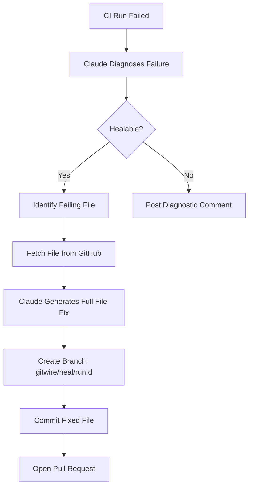

# Auto Patch PRs

How GitWire generates full-file patches and opens pull requests to fix CI failures.

## The Patch Flow



## Full-File Generation

GitWire uses **full-file generation** (not search/replace):

1. Fetch the entire failing file via GitHub Contents API
2. Send file content + error context to Claude
3. Claude returns the **complete corrected file**
4. GitWire commits the full file, replacing the original

::: tip Why full-file?
Search/replace patches suffer from truncation issues with large files. Full-file generation is more reliable and handles whitespace changes correctly.
:::

## Branch Naming

Patch branches follow the pattern:

```
gitwire/heal/{github_run_id}
```

Example: `gitwire/heal/12345678901`

## PR Content

The PR includes:

**Title:** `fix(ci): resolve {failure_type} in {file_path}`

**Body:**
- 🔍 **Root cause**: The diagnosed reason for failure
- 🛠️ **Fix applied**: What was changed
- 📊 **Confidence**: `high` / `medium` / `low`
- 🤖 Generated by GitWire CI Healing

## Pre-Checks Before Committing

Before committing a fix, GitWire validates:

| Check | Rule |
|-------|------|
| Non-empty | File must not be empty after fix |
| Line delta | Must not add > 500 lines or remove > 80% of content |
| Syntax | Basic bracket/paren balance check |

If any check fails, the heal is marked as `failed` and no PR is created.

## Confidence Levels

| Level | Criteria |
|-------|----------|
| `high` | Simple fix (lint, format), single file, clear error |
| `medium` | Multi-cause, partial file fetch, medium complexity |
| `low` | Complex error, multiple files, uncertain diagnosis |

## Tracking

All patch PRs are tracked in the `heal_prs` table:

| Column | Description |
|--------|-------------|
| `ci_run_id` | Reference to the CI run |
| `github_pr_number` | PR number on GitHub |
| `heal_branch` | Branch name used |
| `failure_type` | Category of the failure |
| `files_changed` | Array of modified file paths |
| `status` | `open`, `merged`, or `closed` |

## Worker Reference

See [CI Heal Worker](/workers/ci-heal-worker) for implementation details.

→ [Heal History](/pillars/ci-healing/heal-history)
