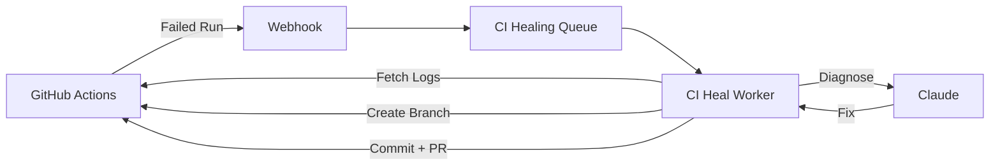

# Self-Healing CI

Automatically diagnose failed CI runs, generate patches, and open fix pull requests.

## Overview

When a GitHub Actions workflow fails:

1. GitHub sends a `workflow_run` webhook with `conclusion: "failure"`
2. GitWire's [CI Heal Worker](/workers/ci-heal-worker) picks up the job
3. Fetches the failure logs from GitHub
4. Sends logs to **Claude** for diagnosis
5. Claude identifies the failure type and root cause
6. If the failure is **healable**, fetches the failing file content
7. Claude generates a fix (full-file content)
8. GitWire creates a branch, commits the fix, and opens a PR

## Failure Diagnosis

Claude analyzes the failure logs and returns:

| Field | Description |
|-------|-------------|
| `heal_failure_type` | One of 9 failure type categories |
| `heal_root_cause` | Human-readable explanation |
| `heal_fix_applied` | What was changed (if healed) |
| `heal_confidence` | `high`, `medium`, or `low` |

## Auto Patch PRs

When a failure is deemed healable, GitWire:

1. Fetches the failing file from GitHub via the Contents API
2. Sends the file content + error context to Claude for a full-file fix
3. Creates a new branch: `gitwire/heal/{run-id}`
4. Commits the fixed file content
5. Opens a PR with a descriptive title and body explaining the fix

The PR body includes:
- The original error message
- What was changed
- Confidence level
- A note that this is an automated fix

## Database Tables

- **`ci_runs`** — CI run records with healing fields
- **`heal_prs`** — Track auto-generated fix PRs

## API Endpoints

| Method | Path | Description |
|--------|------|-------------|
| `GET` | `/api/ci` | List CI runs (paginated) |
| `GET` | `/api/ci/:owner/:repo` | CI runs for a repo |
| `GET` | `/api/ci/stats` | CI statistics |
| `POST` | `/api/ci/:runId/retry` | Retry healing on a run |
| `GET` | `/api/heal` | List heal history |
| `GET` | `/api/heal/:owner/:repo` | Heal history for a repo |
| `GET` | `/api/heal/run/:githubRunId` | Heal history for a specific run |
| `GET` | `/api/heal/stats` | Heal statistics |

## In This Section

- [Failure Types](/pillars/ci-healing/failure-types) — All 9 categories and which are auto-healable
- [Auto Patch PRs](/pillars/ci-healing/auto-patch-prs) — Full-file patch generation flow
- [Heal History](/pillars/ci-healing/heal-history) — Tracking and viewing past heals
