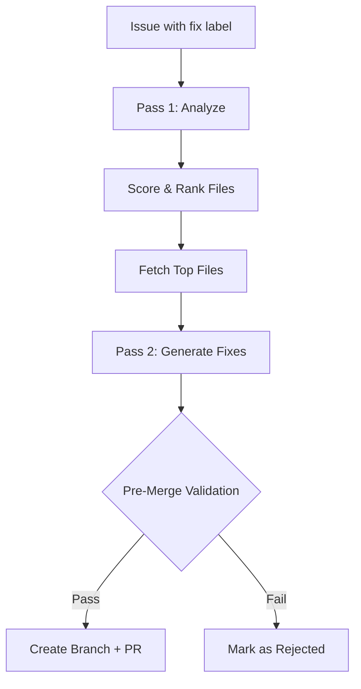

# Autonomous Contributor

AI-powered issue fixing — GitWire analyzes open issues and generates code fixes as pull requests.

## Overview

The Autonomous Contributor uses a **two-pass AI pipeline**:

1. **Pass 1: Analyze** — Claude reads the issue, identifies relevant files, and scores them
2. **Pass 2: Generate** — Claude generates full-file fixes for the top-ranked files

## Trigger Conditions

An issue is eligible for autonomous fixing when:

| Condition | Value |
|-----------|-------|
| **Labels** | Contains at least one: `bug`, `good first issue`, `help wanted`, `enhancement`, `documentation` |
| **Open** | Issue state is `open` |
| **No prior fix** | No existing fix attempt for this issue |
| **Rate limit** | ≤ 3 fix attempts per repo per day |
| **Daily limit** | ≤ 1 fix attempt per issue |

## Two-Pass Pipeline

### Pass 1: Analysis + File Selection

Claude receives the issue title and labels, then:

1. Identifies which files in the repository are relevant
2. Returns a list of candidate files with relevance scores
3. Ranks by: keyword match, proximity to source, language preference

### Pass 2: Full-File Generation

For each top-ranked file:

1. Fetch the file content from GitHub
2. Send file + issue context to Claude
3. Claude returns the **complete corrected file**
4. GitWire validates the fix (see below)

## Rate Limits

| Limit | Value |
|-------|-------|
| Per repo per day | 3 fix attempts |
| Per issue | 1 fix attempt |
| Max files per fix | 5 |

## Database Table

**`fix_attempts`**

| Column | Type | Description |
|--------|------|-------------|
| `repo_id` | BIGINT | Target repository |
| `issue_number` | INT | GitHub issue number |
| `branch_name` | TEXT | Created branch name |
| `pr_number` | INT | Opened PR number |
| `status` | TEXT | `pending` → `analyzing` → `generating` → `submitted` / `failed` / `rejected` |
| `complexity` | TEXT | `trivial`, `simple`, `moderate`, `complex` |
| `explanation` | TEXT | Claude's explanation of the fix |

## API Endpoints

| Method | Path | Description |
|--------|------|-------------|
| `POST` | `/api/fix/:owner/:repo/issues/:number` | Trigger a fix for an issue |
| `GET` | `/api/fix/:owner/:repo/issues/:number` | Get fix status for an issue |
| `GET` | `/api/fix/:owner/:repo/attempts` | List fix attempts for a repo |

## In This Section

- [Scope Guards](/pillars/contributor/scope-guards) — Label filters and rate limits
- [File Scoring](/pillars/contributor/file-scoring) — How files are ranked
- [Pre-Merge Validation](/pillars/contributor/pre-merge-validation) — Safety checks before PR
