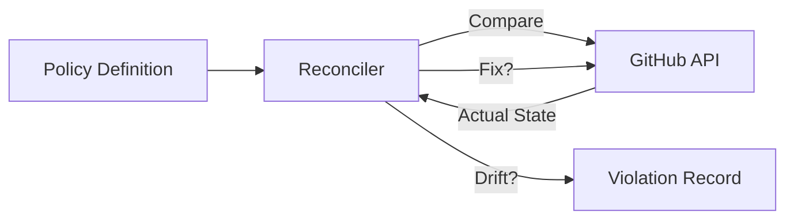

# Branch Enforcement

Policy-as-code for branch protection, naming conventions, and configuration drift detection.

## Overview

GitWire lets you define **enforcement policies** that declare the desired state of branch protection rules. The reconciler compares desired vs. actual state and detects violations.

## Policy Model

Each policy defines:

| Field | Type | Description |
|-------|------|-------------|
| `name` | TEXT | Unique policy name |
| `branch_pattern` | TEXT | Branch pattern to match (e.g. `main`, `release/*`) |
| `repo_filter` | TEXT | Optional glob to limit to specific repos |
| `min_reviews` | INT | Required approving reviews |
| `require_signed_commits` | BOOLEAN | GPG signature required |
| `require_linear_history` | BOOLEAN | No merge commits |
| `block_force_pushes` | BOOLEAN | Prevent force pushes |
| `block_deletions` | BOOLEAN | Prevent branch deletion |
| `enforce_admins` | BOOLEAN | Rules apply to admins too |
| `require_status_checks` | BOOLEAN | Required CI checks |
| `required_status_check_contexts` | TEXT[] | Specific check names |
| `mode` | TEXT | `enforce` or `audit` |

## Enforcement Modes

| Mode | Behavior |
|------|----------|
| `enforce` | Create/update GitHub branch protection rules to match the policy |
| `audit` | Only record violations, don't change GitHub settings |

## Violations

When the reconciler detects drift between policy and reality, it creates a violation record:

| Field | Description |
|-------|-------------|
| `policy_id` | Which policy was violated |
| `repo_id` | Which repo |
| `branch` | Which branch |
| `violations` | JSONB array of specific violations |
| `status` | `open`, `remediated` |

## Config Validation

On every push, GitWire can validate repository configuration files:

- Detects misformatted `.github/` config files
- Checks for common misconfigurations
- Creates `config_validation_results` entries

## API Endpoints (11 total)

| Method | Path | Description |
|--------|------|-------------|
| `GET` | `/api/enforcement/stats` | Enforcement statistics |
| `GET` | `/api/enforcement/policies` | List all policies |
| `POST` | `/api/enforcement/policies` | Create a policy |
| `PUT` | `/api/enforcement/policies/:id` | Update a policy |
| `DELETE` | `/api/enforcement/policies/:id` | Delete a policy |
| `GET` | `/api/enforcement/violations` | List all violations |
| `GET` | `/api/enforcement/violations/:owner/:repo` | Repo violations |
| `POST` | `/api/enforcement/violations/:id/suppress` | Suppress a violation |
| `POST` | `/api/enforcement/run` | Trigger reconciliation run |
| `GET` | `/api/enforcement/config-results` | Config validation results |
| `GET` | `/api/enforcement/config-results/:owner/:repo` | Repo config results |

## In This Section

- [Policies](/pillars/enforcement/policies) — Creating and managing enforcement policies
- [Violations](/pillars/enforcement/violations) — Violation detection and remediation
- [Config Validation](/pillars/enforcement/config-validation) — Push-triggered config checks
