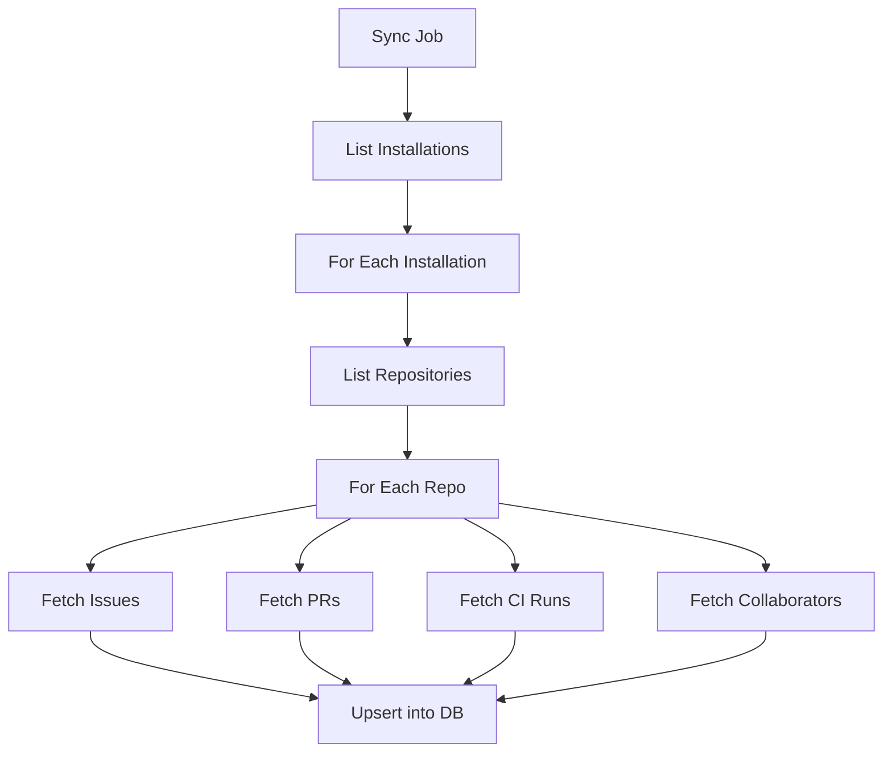

# Sync Engine

How GitWire keeps your GitHub data fresh in the local database.

## Sync Types

| Job Name | Trigger | Scope |
|----------|---------|-------|
| `full-sync` | Manual / startup | All installations, all repos |
| `sync-installation` | App installed/updated | One installation, all repos |
| `sync-repo` | New repo webhook | Single repository |

## What Gets Synced

For each repository:

| Data | GitHub API | Local Table |
|------|-----------|-------------|
| Repository metadata | `GET /repos/:owner/:repo` | `repositories` |
| Open issues | `GET /repos/:owner/:repo/issues` | `issues` |
| Open pull requests | `GET /repos/:owner/:repo/pulls` | `pull_requests` |
| Recent CI runs | `GET /repos/:owner/:repo/actions/runs` | `ci_runs` |
| Org members | `GET /orgs/:org/members` | `members` |
| Collaborators | `GET /repos/:owner/:repo/collaborators` | `repo_collaborators` |
| Branch rules | `GET /repos/:owner/:repo/branches` | `branch_rules` |

## Sync Flow



## Triggering a Sync

```bash
# Sync a specific repo
curl -X POST https://gitwire.yourdomain.com/api/repos/owner/repo/sync \
  -H "Authorization: Bearer YOUR_API_KEY"
```

## Error Handling

Sync errors are always logged (never silently caught). If a single repo fails, the sync continues to the next repo. Failed items are logged with:

- Repository name
- API endpoint
- HTTP status code
- Error message

## Worker Reference

See [Sync Worker](/workers/sync-worker) for implementation details.

→ [Branch Enforcement](/pillars/enforcement/branch-enforcement)
