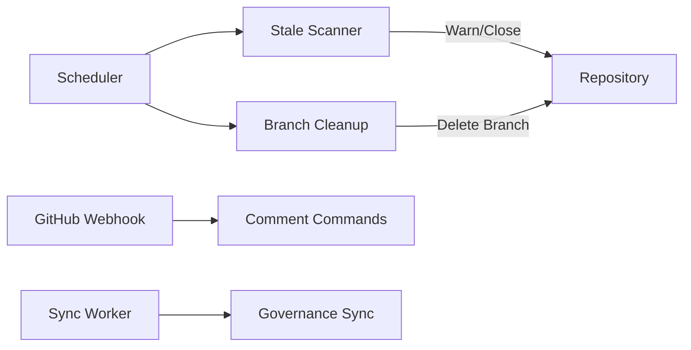

# Maintainer Tools

Automated repository maintenance — stale management, branch cleanup, settings sync, and comment commands.

## Overview

The Maintainer pillar runs **scheduled jobs** to keep your repositories healthy:

| Feature | Schedule | Description |
|---------|----------|-------------|
| Stale Scanner | Configurable | Warn and close stale issues/PRs |
| Branch Cleanup | On demand | Delete merged branches |
| Comment Commands | Event-driven | `/gitwire` commands in comments |
| Settings API | On demand | Read/update repo settings |
| Governance Sync | On sync | Members, collaborators, branch rules |



## Stale Management

### How It Works

1. Worker scans all open issues and PRs in configured repos
2. Checks `updated_at` against the configured threshold
3. If stale and not warned: posts a warning comment + adds `stale` label
4. If already warned and past close threshold: closes the item
5. Skips items with `pinned` or `keep-alive` labels
6. Skips items created by bot accounts

### Configuration

Per-repo settings via the `maintainer_settings` table:

| Setting | Default | Description |
|---------|---------|-------------|
| `stale_issue_days` | 60 | Days before an issue is marked stale |
| `stale_pr_days` | 30 | Days before a PR is marked stale |
| `stale_warn_days` | 7 | Days after warning before closing |
| `cleanup_branches` | `true` | Whether to auto-delete merged branches |
| `enabled` | `true` | Enable/disable maintainer features |

## Branch Cleanup

Finds branches that have been merged into the default branch and deletes them. Skips:
- The default branch itself
- Protected branches
- Branches with open PRs

## Comment Commands

See [Comment Commands](/pillars/triage/comment-commands) for the full reference.

## Settings API

Read and update repository settings programmatically:

```bash
# Get settings
curl https://gitwire.yourdomain.com/api/maintainer/owner/repo/settings \
  -H "Authorization: Bearer YOUR_API_KEY"

# Update settings
curl -X PATCH https://gitwire.yourdomain.com/api/maintainer/owner/repo/settings \
  -H "Authorization: Bearer YOUR_API_KEY" \
  -H "Content-Type: application/json" \
  -d '{"stale_issue_days": 90, "stale_pr_days": 45}'
```

## API Endpoints (17 total)

| Method | Path | Description |
|--------|------|-------------|
| `GET` | `/api/maintainer/members` | List all org members |
| `POST` | `/api/maintainer/members/sync` | Sync members from GitHub |
| `GET` | `/api/maintainer/members/:login` | Get specific member |
| `GET` | `/api/maintainer/collaborators` | List all collaborators |
| `GET` | `/api/maintainer/collaborators/:owner/:repo` | Repo collaborators |
| `PUT` | `/api/maintainer/collaborators/:owner/:repo/:login` | Update collaborator |
| `DELETE` | `/api/maintainer/collaborators/:owner/:repo/:login` | Remove collaborator |
| `GET` | `/api/maintainer/branch-rules` | List all branch rules |
| `GET` | `/api/maintainer/branch-rules/:owner/:repo` | Repo branch rules |
| `PUT` | `/api/maintainer/branch-rules/:owner/:repo/:pattern` | Update branch rule |
| `GET` | `/api/maintainer/audit` | Audit log entries |
| `GET` | `/api/maintainer/:owner/:repo/settings` | Repo settings |
| `PATCH` | `/api/maintainer/:owner/:repo/settings` | Update settings |
| `GET` | `/api/maintainer/:owner/:repo/actions` | Maintainer actions log |
| `GET` | `/api/maintainer/:owner/:repo/stats` | Repo statistics |
| `POST` | `/api/maintainer/:owner/:repo/stale-scan` | Trigger stale scan |
| `POST` | `/api/maintainer/:owner/:repo/branch-cleanup` | Trigger branch cleanup |

## In This Section

- [Stale Management](/pillars/maintainer/stale-management)
- [Branch Cleanup](/pillars/maintainer/branch-cleanup)
- [Settings API](/pillars/maintainer/settings-api)
