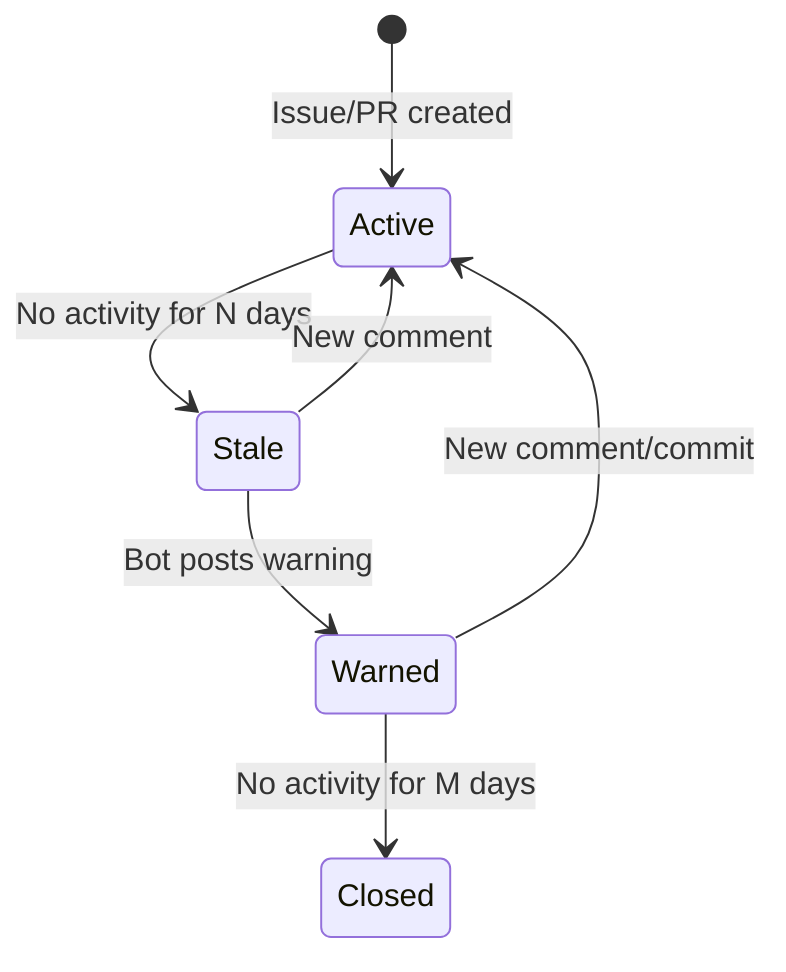

# Stale Management

Automatically identify, warn, and close stale issues and pull requests.

## Lifecycle



## Idempotency

The stale scanner uses **idempotency keys** to prevent duplicate actions:

- Warning: `stale-warn-{repo_id}-{type}-{number}`
- Closing: `stale-close-{repo_id}-{type}-{number}`

If an action with the same key already exists in `maintainer_actions`, it is skipped.

## Bot Filter

Items created by accounts whose login contains `[bot]` are always skipped.

## Label Exemptions

Issues with these labels are **never** marked stale:

| Label | Reason |
|-------|--------|
| `pinned` | Explicitly kept open |
| `keep-alive` | Maintainer opt-out |

## Trigger

```bash
# Manual trigger for a repo
curl -X POST https://gitwire.yourdomain.com/api/maintainer/owner/repo/stale-scan \
  -H "Authorization: Bearer YOUR_API_KEY"
```

The stale scanner also runs on the configured schedule via the [Maintainer Worker](/workers/maintainer-worker).

## Actions Log

All stale actions are recorded in `maintainer_actions`:

| Column | Values |
|--------|--------|
| `action_type` | `stale_warn`, `stale_close` |
| `target_type` | `issue`, `pr` |
| `target_number` | Issue/PR number |
| `idempotency_key` | Unique key per action |
| `status` | `pending`, `applied`, `skipped`, `failed` |

→ [Branch Cleanup](/pillars/maintainer/branch-cleanup)
