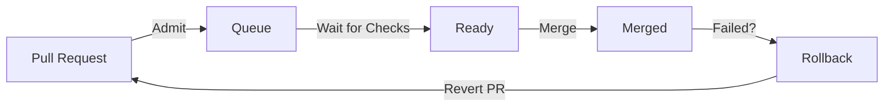

# Merge Queue

Batched merge queue with error recovery, rollback support, and configurable feedback rules.

## Overview

The merge queue manages PR merges in an ordered, batched fashion:



## Queue Configuration

Per-repo settings:

```bash
curl -X POST https://gitwire.yourdomain.com/api/phase2/queue/owner/repo/config \
  -H "Authorization: Bearer YOUR_API_KEY" \
  -H "Content-Type: application/json" \
  -d '{
    "enabled": true,
    "merge_method": "squash",
    "delete_branch": true,
    "required_checks": ["ci/test", "ci/lint"],
    "max_queue_depth": 20,
    "check_timeout_mins": 60,
    "rollback_enabled": true,
    "base_branch": "main"
  }'
```

## Queue Entry Lifecycle

| Status | Meaning |
|--------|---------|
| `pending` | Waiting in queue |
| `ready` | All checks passed, awaiting merge |
| `merged` | Successfully merged |
| `blocked` | Checks failed, needs attention |

## Feedback Rules

Configure notifications for merge events:

```bash
# Create a feedback rule
curl -X POST https://gitwire.yourdomain.com/api/phase2/feedback \
  -H "Authorization: Bearer YOUR_API_KEY" \
  -H "Content-Type: application/json" \
  -d '{
    "name": "merge-notification",
    "event_type": "merge_success",
    "post_pr_comment": true,
    "include_log_link": true
  }'
```

## Error Recovery

When a merge fails, GitWire can:
1. Automatically retry with configurable backoff
2. Create a rollback event
3. Open a revert PR if `rollback_enabled` is true

## Telemetry

| Endpoint | Description |
|----------|-------------|
| `GET /api/phase2/telemetry/summary` | Queue health summary |
| `GET /api/phase2/telemetry/events` | Recent pipeline events |
| `GET /api/phase2/telemetry/throughput` | Merge throughput metrics |
| `GET /api/phase2/telemetry/ci-health` | CI health across repos |

## Rollback Events

When a merge causes issues, rollback events track:

- Original merge commit
- Revert commit
- Revert PR number
- Trigger reason
- Status: `pending` → `completed`

## API Endpoints (14 total)

| Method | Path | Description |
|--------|------|-------------|
| `GET` | `/api/phase2/queue` | List all queue entries |
| `GET` | `/api/phase2/queue/:owner/:repo` | Queue for a repo |
| `POST` | `/api/phase2/queue/:owner/:repo/config` | Set queue config |
| `POST` | `/api/phase2/queue/:owner/:repo/:pr/admit` | Admit a PR to queue |
| `POST` | `/api/phase2/queue/:owner/:repo/:pr/remove` | Remove from queue |
| `GET` | `/api/phase2/feedback` | List feedback rules |
| `POST` | `/api/phase2/feedback` | Create feedback rule |
| `PUT` | `/api/phase2/feedback/:id` | Update rule |
| `DELETE` | `/api/phase2/feedback/:id` | Delete rule |
| `GET` | `/api/phase2/telemetry/summary` | Telemetry summary |
| `GET` | `/api/phase2/telemetry/events` | Pipeline events |
| `GET` | `/api/phase2/telemetry/throughput` | Throughput metrics |
| `GET` | `/api/phase2/telemetry/ci-health` | CI health stats |
| `GET` | `/api/phase2/rollbacks` | Rollback history |

## In This Section

- [Error Recovery](/pillars/merge-queue/error-recovery) — Auto-retry and rollback
- [Feedback Rules](/pillars/merge-queue/feedback-rules) — Notification configuration
