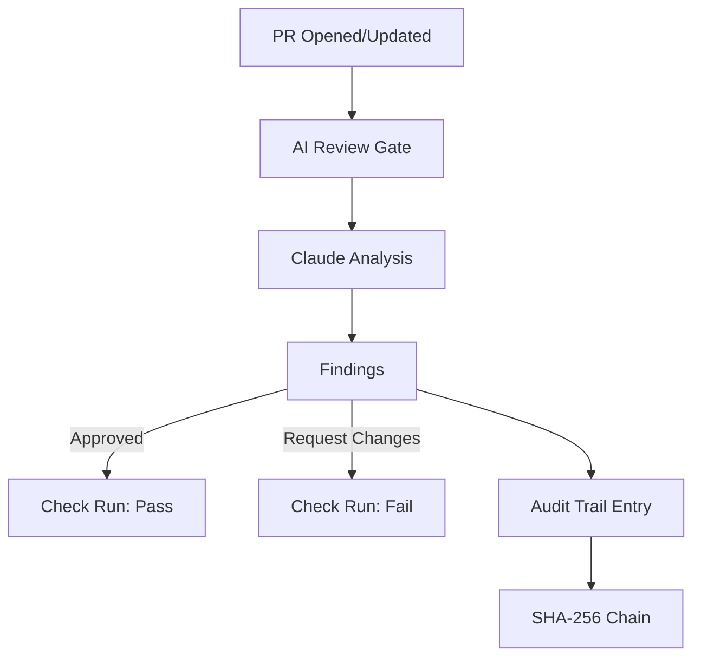

# AI Review Gate

Pre-merge AI code review with secret detection, antipattern analysis, and a tamper-proof audit trail.

## Overview



When a PR is opened or updated, GitWire:

1. Fetches the diff and changed files
2. Sends to Claude for code review
3. Checks for: logic errors, security issues, architectural problems, cost leaks, test coverage
4. Creates a GitHub **Check Run** with the verdict
5. Optionally creates a **PR Review** with inline comments
6. Records the review in an **immutable audit trail**

## Review Categories

| Category | What It Checks |
|----------|---------------|
| `check_logic` | Logic errors, race conditions, null references |
| `check_security` | Hardcoded secrets, SQL injection, XSS vectors |
| `check_architecture` | Layer violations, circular dependencies, tight coupling |
| `check_cost_leaks` | Unbounded queries, missing pagination, resource leaks |
| `check_tests` | Missing tests for changed code, test quality |
| `check_docs` | Missing documentation for public APIs |

## Verdicts

| Verdict | Meaning | Action |
|---------|---------|--------|
| `approved` | No issues found | Check passes ✅ |
| `request_changes` | Issues found that should be fixed | Check fails ❌ |
| `needs_discussion` | Ambiguous changes, needs human review | Check warns ⚠️ |

## Check Runs

GitWire creates GitHub Check Runs visible in the PR status bar. If `checks:write` permission is not available, it falls back to PR Review comments only.

## Per-Repo Configuration

```bash
curl -X POST https://gitwire.yourdomain.com/api/review/config/owner/repo \
  -H "Authorization: Bearer YOUR_API_KEY" \
  -H "Content-Type: application/json" \
  -d '{
    "enabled": true,
    "check_security": true,
    "check_logic": true,
    "block_on_verdict": ["request_changes"],
    "max_files_to_review": 30,
    "ignore_patterns": ["*.lock", "package-lock.json", "dist/**"]
  }'
```

## API Endpoints (13 total)

| Method | Path | Description |
|--------|------|-------------|
| `GET` | `/api/review/stats` | Review statistics |
| `GET` | `/api/review/results` | All review results |
| `GET` | `/api/review/results/:owner/:repo` | Reviews for a repo |
| `GET` | `/api/review/config/:owner/:repo` | Get review config |
| `POST` | `/api/review/config/:owner/:repo` | Update review config |
| `POST` | `/api/review/trigger/:owner/:repo/:pr` | Manually trigger review |
| `GET` | `/api/audit/stats` | Audit trail statistics |
| `GET` | `/api/audit/entries` | Audit trail entries |
| `GET` | `/api/audit/verify` | Verify chain integrity |
| `POST` | `/api/audit/export` | Export audit data |
| `GET` | `/api/audit/reports` | List compliance reports |
| `POST` | `/api/audit/reports` | Generate compliance report |
| `GET` | `/api/audit/reports/:id` | Get specific report |

## In This Section

- [Review Findings](/pillars/review-gate/review-findings) — Finding categories and severity levels
- [Audit Trail](/pillars/review-gate/audit-trail) — SHA-256 chain integrity
- [Compliance Reports](/pillars/review-gate/compliance-reports) — SOC2 report generation
