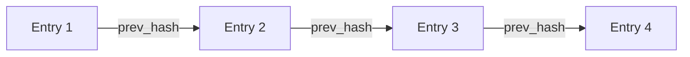

# Audit Trail

Tamper-proof SHA-256 chained audit trail for all GitWire decisions.

## How It Works

Every significant GitWire action creates an **immutable** audit trail entry:

1. The entry payload is serialized as JSON
2. A **SHA-256 hash** is computed
3. The `prev_hash` field links to the previous entry
4. The entry is inserted and **never updated or deleted**



## Categories

| Category | Events |
|----------|--------|
| `ai_decision` | Triage, CI diagnosis, fix generation |
| `auto_merge` | Merge queue operations |
| `policy_bypass` | Enforcement exceptions |
| `branch_rule` | Branch protection changes |
| `config_change` | Repository configuration changes |
| `vulnerability_dismissed` | Security advisory dismissals |
| `quarantine` | Flaky test quarantine |
| `heal` | CI healing actions |
| `rollback` | Merge rollbacks |
| `review_gate` | AI review decisions |

## Actor Types

| Type | Description |
|------|-------------|
| `human` | A GitHub user triggered the action |
| `bot` | GitWire bot account |
| `system` | Scheduled/automated process |

## Chain Verification

```bash
curl https://gitwire.yourdomain.com/api/audit/verify \
  -H "Authorization: Bearer YOUR_API_KEY"
```

Returns:

```json
{
  "valid": true,
  "entries_checked": 142,
  "gaps": 0,
  "hash_mismatches": 0
}
```

::: info PostgreSQL JSONB Normalization
PostgreSQL normalizes JSONB key order on storage, which means re-reading a payload produces a different string than the original. To handle this, chain verification checks `prev_hash` linkage (each entry points to the previous) rather than rehashing round-tripped payloads.
:::

## Querying the Audit Trail

```bash
# All entries (paginated)
curl https://gitwire.yourdomain.com/api/audit/entries \
  -H "Authorization: Bearer YOUR_API_KEY"

# Statistics
curl https://gitwire.yourdomain.com/api/audit/stats \
  -H "Authorization: Bearer YOUR_API_KEY"
```

## Export

```bash
curl -X POST https://gitwire.yourdomain.com/api/audit/export \
  -H "Authorization: Bearer YOUR_API_KEY"
```

## Compliance Frameworks

Each entry can tag relevant compliance frameworks:

| Framework | Tag |
|-----------|-----|
| SOC 2 | `soc2` |
| ISO 27001 | `iso27001` |
| GDPR | `gdpr` |
| HIPAA | `hipaa` |

→ [Compliance Reports](/pillars/review-gate/compliance-reports)
