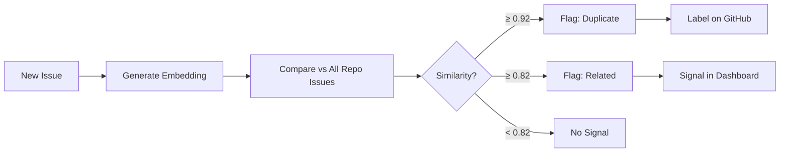

# Duplicate Detection

Automatic detection of duplicate issues using text embeddings and cosine similarity.

## How It Works



## Embedding Pipeline

### Text Preparation

The embedding text is constructed from:
- Issue **title** (weighted 2× by repeating)
- First 500 characters of the issue body

### Embedding Method

GitWire uses a **512-dimensional trigram hash** vector as the embedding method.

::: info Why trigram hash?
GitWire originally used Voyage AI `voyage-3-lite` embeddings, but the third-party Anthropic proxy (`api.z.ai`) returns 404 for `/v1/embeddings`. The trigram hash fallback is deterministic, requires no external API calls, and works well for duplicate detection on short text.
:::

The embedding process:
1. Extract all character trigrams from the text
2. Hash each trigram to a bucket (0–511)
3. Build a 512-dim float vector with normalized counts
4. Store in `issue_embeddings.embedding`

### Storage

| Column | Type | Description |
|--------|------|-------------|
| `issue_id` | BIGINT | Reference to the issue |
| `repo_id` | BIGINT | Reference to the repo |
| `embedding` | REAL[] | 512-dim float vector |
| `embedded_text` | TEXT | The text that was embedded |
| `model` | TEXT | `voyage-3-lite` (legacy) or `trigram-hash` |

## Similarity Calculation

Cosine similarity between two embedding vectors:

```
similarity = dot(A, B) / (norm(A) * norm(B))
```

Where `norm` is the Euclidean (L2) norm. The calculation is done entirely in PostgreSQL using array operators.

## Thresholds

| Similarity | Signal | Action |
|-----------|--------|--------|
| ≥ 0.92 | **duplicate** | Apply `duplicate` label on GitHub, post comment |
| ≥ 0.82 | **related** | Record signal, no GitHub action |
| < 0.82 | — | No signal created |

## Duplicate Signal Lifecycle

```
pending → confirmed (maintainer confirms via dashboard)
pending → dismissed (maintainer dismisses via dashboard)
```

Duplicates are **never auto-closed**. Only the label is applied. A maintainer must explicitly confirm.

## Backfill

To generate embeddings for existing issues that predate duplicate detection:

```bash
curl -X POST https://gitwire.yourdomain.com/api/duplicates/backfill/owner/repo \
  -H "Authorization: Bearer YOUR_API_KEY"
```

## Issue Upsert

New webhook issues are upserted into the database **before** embedding runs, ensuring the issue exists for the foreign key constraint.

## Database Tables

- **`issue_embeddings`** — Vectors and embedded text
- **`duplicate_signals`** — Pairwise similarity records

→ [Comment Commands](/pillars/triage/comment-commands)
