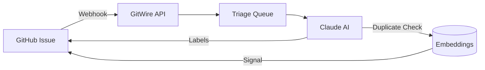

# Issue & PR Triage

Automatically classify, prioritize, and detect duplicates in your GitHub issues and pull requests.

## Overview

When a new issue or PR is created, GitWire:

1. **Receives** the webhook from GitHub
2. **Queues** a triage job in BullMQ
3. **Sends** the issue title and metadata to Claude
4. **Classifies** by type (bug, feature, question, etc.)
5. **Assigns** priority (critical, high, medium, low)
6. **Generates** a one-line summary
7. **Detects** duplicates against existing issues
8. **Applies** labels on GitHub

## How It Works

### AI Classification

Claude analyzes the issue title and metadata, returning:

| Field | Values |
|-------|--------|
| `triage_type` | `bug`, `feature`, `question`, `documentation`, `enhancement`, `performance`, `security`, `other` |
| `triage_priority` | `critical`, `high`, `medium`, `low` |
| `triage_summary` | One-line human-readable summary |

### Duplicate Detection

Every issue is embedded using a 512-dimensional trigram hash vector. New issues are compared against all existing issues in the same repository:

| Similarity | Action |
|-----------|--------|
| ≥ 0.92 | Flag as **duplicate** |
| ≥ 0.82 | Flag as **related** |
| < 0.82 | No action |

Duplicates are never auto-closed — only labeled. A maintainer must confirm via the dashboard.

### Comment Commands

Maintainers can trigger triage manually by commenting on an issue:

| Command | Action |
|---------|--------|
| `/gitwire triage` | Re-triage the issue |
| `/gitwire status` | Show issue info + repo stats |

Only users with `OWNER`, `MEMBER`, or `COLLABORATOR` permissions can use these commands.

## API Endpoints

| Method | Path | Description |
|--------|------|-------------|
| `GET` | `/api/issues` | List all issues (paginated) |
| `GET` | `/api/issues/:owner/:repo` | List issues for a repo |
| `GET` | `/api/issues/stats` | Issue statistics |
| `GET` | `/api/duplicates` | List duplicate signals |
| `POST` | `/api/duplicates/:id/confirm` | Confirm a duplicate |
| `POST` | `/api/duplicates/:id/dismiss` | Dismiss a signal |
| `POST` | `/api/duplicates/backfill/:owner/:repo` | Backfill embeddings for a repo |

## Database Tables

- **`issues`** — Issue data with triage fields
- **`pull_requests`** — PR data with triage fields
- **`issue_embeddings`** — 512-dim vectors for duplicate detection
- **`duplicate_signals`** — Similarity scores between issue pairs

## In This Section

- [AI Classification](/pillars/triage/ai-classification) — How Claude classifies issues
- [Duplicate Detection](/pillars/triage/duplicate-detection) — Embedding pipeline and thresholds
- [Comment Commands](/pillars/triage/comment-commands) — `/gitwire` commands reference
