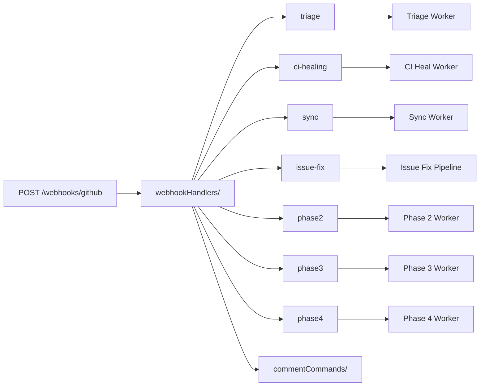

# Workers

GitWire runs 9 background workers powered by BullMQ and Redis, plus a periodic reconciliation job.

## Overview

| Worker | Queue | Source File | Purpose |
|--------|-------|-------------|---------|
| [Webhook Worker](/workers/webhook-worker) | `webhook-events` | `workers/webhookWorker.js` | Route incoming webhooks |
| [Triage Worker](/workers/triage-worker) | `triage` | `workers/triageWorker.js` | AI issue/PR classification |
| [CI Heal Worker](/workers/ci-heal-worker) | `ci-healing` | `workers/ciHealWorker.js` | Diagnose and fix CI failures |
| [Sync Worker](/workers/sync-worker) | `sync` | `workers/syncWorker.js` | GitHub data synchronization |
| [Maintainer Worker](/workers/maintainer-worker) | `maintainer` | `workers/maintainerWorker.js` | Stale scans, branch cleanup |
| [Issue Fix Worker](/workers/issue-fix-worker) | `issue-fix` | `workers/issueFixWorker.js` → `issueFix/` | Autonomous code fixes (6-stage pipeline) |
| [Phase 2 Worker](/workers/phase2-worker) | `phase2` | `workers/phase2Worker.js` | Merge queue, error recovery |
| [Phase 3 Worker](/workers/phase3-worker) | `phase3` | `workers/phase3Worker.js` | Flaky tests, deps, policy |
| [Phase 4 Worker](/workers/phase4-worker) | `phase4` | `workers/phase4Worker.js` | AI review, audit trail |

## Periodic Jobs (not separate workers)

| Job | Schedule | Source File | Purpose |
|-----|----------|-------------|---------|
| Reconciliation | Every 6 hours | `workers/reconciliationWorker.js` | Verify actions still in effect on GitHub |
| Full Sync | Every 30 min | `workers/syncWorker.js` | Periodic GitHub data refresh |
| Stale Scan | Every 6 hours | `workers/maintainerWorker.js` | Detect stale issues/PRs |
| Branch Cleanup | Daily | `workers/maintainerWorker.js` | Delete merged branches |
| Policy Reconciliation | Nightly | `workers/phase3Worker.js` | Policy drift detection |
| Audit Export | Nightly 01:00 UTC | `workers/phase4Worker.js` | Audit trail generation |

## Architecture



## Queue Configuration

All queues use BullMQ with default settings:

| Setting | Value |
|---------|-------|
| Concurrency | 1 (per worker) |
| Attempts | 3 |
| Backoff | Exponential |
| Remove on complete | Keep last 100 |

## Starting Workers

Workers start automatically with the main application (`src/index.js`). All workers run in the same `gitwire-app` container as the Express API server.

```bash
# Check worker health
curl https://gitwire.yourdomain.com/health
```

The health endpoint lists all active workers and queue statuses.

## Error Handling

All worker errors are logged via structured logging (`logger.error`). Failed jobs are retried up to 3 times with exponential backoff. Empty catches use `logger.debug` with context explaining why the error is non-critical.

→ [Webhook Worker](/workers/webhook-worker) | [Action Lifecycle](/architecture/action-lifecycle)

> **Last validated:** v0.13.0
