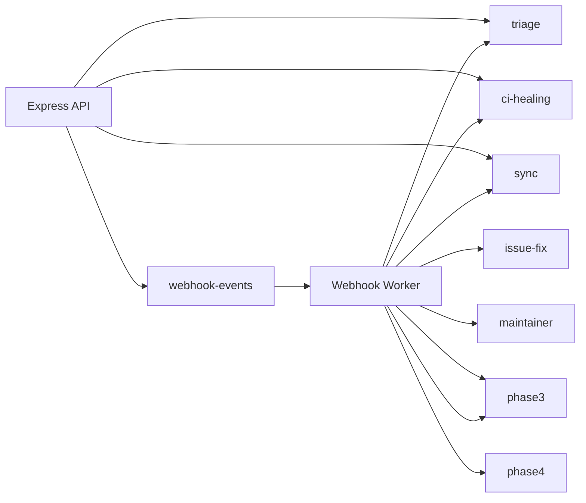

# Workers

GitWire runs 9 background workers powered by BullMQ and Redis.

## Overview

| Worker | Queue | Purpose |
|--------|-------|---------|
| [Webhook Worker](/workers/webhook-worker) | `webhook-events` | Route incoming webhooks |
| [Triage Worker](/workers/triage-worker) | `triage` | AI issue classification |
| [CI Heal Worker](/workers/ci-heal-worker) | `ci-healing` | Diagnose and fix CI failures |
| [Sync Worker](/workers/sync-worker) | `sync` | GitHub data synchronization |
| [Maintainer Worker](/workers/maintainer-worker) | `maintainer` | Stale scans, cleanup |
| [Issue Fix Worker](/workers/issue-fix-worker) | `issue-fix` | Autonomous code fixes |
| [Phase 2 Worker](/workers/phase2-worker) | `phase2` | Merge queue, error recovery |
| [Phase 3 Worker](/workers/phase3-worker) | `phase3` | Flaky tests, deps, policy |
| [Phase 4 Worker](/workers/phase4-worker) | `phase4` | AI review, audit trail |

## Architecture



## Queue Configuration

All queues use BullMQ with default settings:

| Setting | Value |
|---------|-------|
| Concurrency | 1 (per worker) |
| Attempts | 3 |
| Backoff | Exponential |
| Remove on complete | Keep last 100 |

## Starting Workers

Workers start automatically with the main application. All workers run in the same `gitwire-app` container as the Express API server.

```bash
# Check worker health
curl https://gitwire.yourdomain.com/health
```

The health endpoint lists all active workers and queue statuses.

## Error Handling

All worker errors are logged (never silently caught). Failed jobs are retried up to 3 times with exponential backoff.

→ [Webhook Worker](/workers/webhook-worker)
