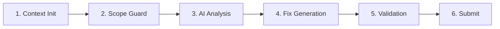

# Issue Fix Worker

Autonomous contributor — analyzes issues and generates code fix PRs.

## Queue: `issue-fix`

## Six-Stage Pipeline

The issue fix pipeline is structured as a 6-stage sequential pipeline. Each stage returns its result or `null` for early exit. The main orchestrator (`issueFix/pipeline.js`) is a thin router with CC ~8.



### Stage 1: Context Init (`context.js`)

Sets up the pipeline context:

1. **Idempotency check** — Redis key `gitwire:idem:fix:{repo}/{issue}` with 1-hour TTL prevents duplicate runs
2. **Config resolution** — 4-layer chain: default ← org ← repo ← DB overrides
3. **Rate limit check** — ≤ 3 fixes per repo/day, ≤ 1 per issue
4. **Dry run check** — If enabled, skips all mutations

Returns the context object or `null` (early exit).

### Stage 2: Scope Guard (`scopeGuard.js`)

Validates the issue is eligible for autonomous fixing:

1. **Label check** — Issue must have `bug`, `good first issue`, `help wanted`, `enhancement`, or `documentation` label
2. **Tree fetch** — Gets the repository file tree to identify candidate files

Returns the scope object (issue + tree + settings) or `null` (ineligible).

### Stage 3: AI Analysis (`analyze.js`)

First AI pass — determines fix complexity:

1. Sends issue context to Claude: title, labels, description, file tree
2. Claude returns a complexity assessment and candidate file list
3. **Complexity gate** — overly complex issues are rejected (confidence too low)

### Stage 4: Fix Generation (`generate.js`)

Second AI pass — generates the actual code fix:

1. **File scoring** — ranks candidate files by keyword match, proximity, language preference
2. Fetches top-ranked files from GitHub Contents API
3. Sends file content + issue context to Claude: "Generate a fix"
4. Claude returns the complete corrected file(s)

### Stage 5: Validation (`validate.js`)

Pre-merge validation catches bad fixes before they reach GitHub:

| Check | Rule |
|-------|------|
| Non-empty | Fix must not be empty |
| Line delta | ≤ 500 lines added, ≤ 80% removed |
| Syntax balance | Brackets/parens must match |
| File count | ≤ 5 files per fix |
| Risk score | Calculated from diff size + scope |
| Confidence | Must meet pillar's confidence gate |
| Blocked paths | No edits to `.env`, secrets, lock files |
| Action state machine | Creates and tracks managed action |

### Stage 6: Submit (`submit.js`)

Publishes the fix as a pull request:

1. **Branch** — `gitwire/fix-{issue_number}` (idempotent if branch exists)
2. **Commit** — Fixed files committed via GitHub Contents API
3. **PR** — Opened with auto-generated title and description
4. **Comment** — Posts summary comment on the original issue

## File Structure

```
workers/issueFix/
├── pipeline.js     # 6-stage orchestrator (CC ~8)
├── context.js      # Stage 1: idempotency, config, rate limit
├── scopeGuard.js   # Stage 2: label check, tree fetch
├── analyze.js      # Stage 3: AI pass 1, complexity gate
├── generate.js     # Stage 4: file scoring, AI pass 2
├── validate.js     # Stage 5: risk, confidence, scope, patches
├── submit.js       # Stage 6: branch, commit, PR, comment
└── helpers.js      # Shared: extractJSON, truncate, fetchFileContents
```

The entry point (`workers/issueFixWorker.js`) is 26 lines — it just registers the BullMQ processor and delegates to `processFixIssue()`.

## Confidence Calibration

| Level | Criteria |
|-------|----------|
| `high` | Trivial/simple fix, file fetched OK |
| `medium` | Moderate complexity, partial fetch |
| `low` | Complex, file fetch failed |

## Triggering

The fix pipeline is triggered by:

- **`/gitwire fix`** comment command — manual trigger
- **AI triage** — if triage classifies an issue as fixable and the `issue_fix` pillar is enabled

→ [Maintainer Worker](/workers/maintainer-worker) | [Comment Commands](/pillars/triage/comment-commands) | [Action Lifecycle](/architecture/action-lifecycle)

> **Last validated:** v0.13.0
