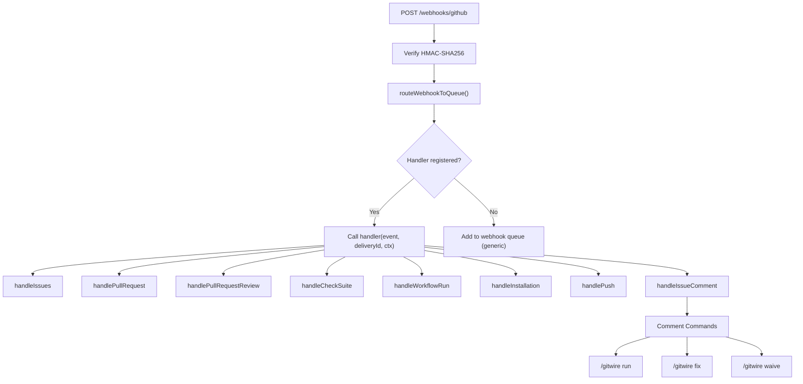

# Webhook Worker

Receives and routes all incoming GitHub webhooks to the appropriate handler.

## Architecture

Webhook routing uses a **handler registry pattern**. The main dispatcher (`lib/webhookHandlers/index.js`) maps event names to handler functions:



## Handler Registry

| Event | Handler File | Actions Handled | Routes To |
|-------|-------------|-----------------|-----------|
| `issues` | `handleIssues.js` | `opened`, `reopened`, `edited` | triage queue |
| `pull_request` | `handlePullRequest.js` | `opened`, `reopened`, `ready_for_review`, `synchronize`, `closed` | triage queue, phase4 queue, reconciliation |
| `pull_request_review` | `handlePullRequestReview.js` | `submitted` (approved only) | merge queue (phase2) |
| `check_suite` | `handleCheckSuite.js` | `completed` | merge queue check |
| `workflow_run` | `handleWorkflowRun.js` | `completed` | ci-heal queue (failures), merge queue, rollback eval, test ingestion |
| `installation` | `handleInstallation.js` | `created`, `new_permissions_accepted` | sync queue |
| `installation_repositories` | `handleInstallation.js` | `added` | sync queue |
| `push` | `handlePush.js` | all pushes | config cache invalidation, sync queue |
| `issue_comment` | `handleIssueComment.js` | `created` (bot command) | comment command sub-dispatcher |

All other events are added to the `webhook-events` queue as generic events.

## Comment Commands

`issue_comment` events containing `/gitwire` are parsed by `commentRouter.js` and dispatched to sub-handlers in `commentCommands/`:

| Command | Handler | Description |
|---------|---------|-------------|
| `/gitwire run [pillar]` | `handleManualRun.js` | Re-evaluate one or more pillars for an issue/PR |
| `/gitwire fix` | `handleFixCommand.js` | Trigger autonomous issue fix pipeline |
| `/gitwire waive [policy]` | `handleWaiverCommand.js` | Grant or revoke a policy waiver |

## Shared Context

All handlers receive a shared `ctx` object instead of importing queues directly:

```javascript
const ctx = {
  webhookQueue, triageQueue, ciHealQueue, maintainerQueue,
  issueFixQueue, phase2Queue, phase3Queue, phase4Queue,
  redis, db, logger, getInstallationClient, wrapOctokit,
};
```

This keeps each handler file focused on event logic (CC ~3-8) without infrastructure imports.

## Webhook Verification

Every webhook is verified using HMAC-SHA256 with the `GITHUB_WEBHOOK_SECRET`. Invalid signatures are rejected with 401.

## Delivery Logging

All webhooks are logged in `webhook_deliveries` with:
- Delivery ID, event name, action
- Processing status (success/failed)
- Error message if failed

→ [Webhook Routing](/architecture/webhook-routing) | [Comment Commands](/pillars/triage/comment-commands) | [Triage Worker](/workers/triage-worker)

> **Last validated:** v0.13.0
